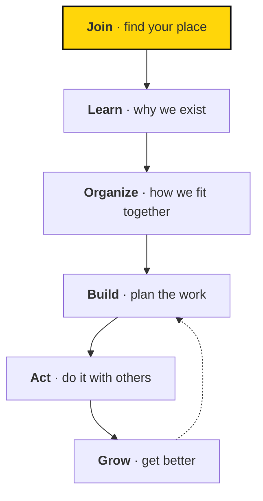
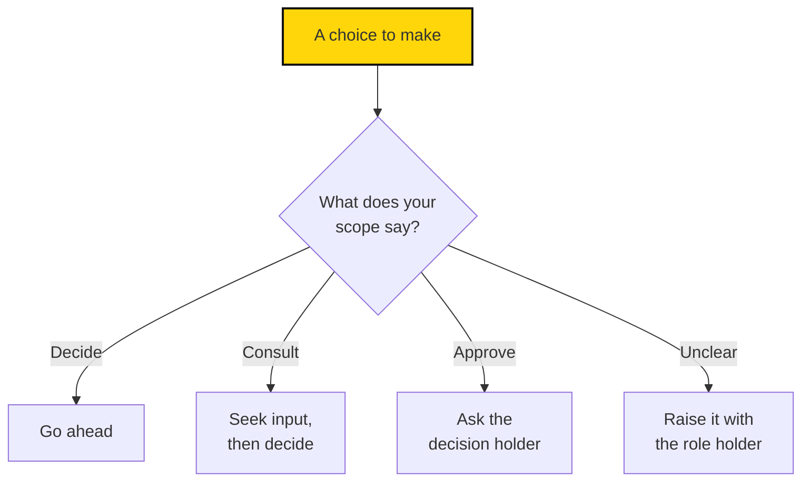

# Readability rewrite: names, frames, and prose

This is the work plan for applying [STYLE-GUIDE.md](STYLE-GUIDE.md) to every handbook page. Follow it step by step. When this plan and your own judgment disagree, follow the plan and note the disagreement in your report.

**Stage 1 is done.** The homepage, the Welcome page (`docs/guide/index.md`), and the six section overviews (`docs/*/index.md`) are already rewritten. Use them as your reference for tone. Only edit them again for stage 2a's renames, or to fix a link to a heading you renamed.

**Stage 2a applies the naming scheme:** six one-word section verbs and short noun page titles, updated everywhere they appear. It's mechanical and site-wide, so it goes first.

**Stage 2b fixes the frame of each topic page:** its opening, its `##` headings, the first sentence of each section, and one diagram on the four pages listed below.

**Stage 3 tightens the prose inside each page:** paragraphs, lists, and the text inside labelled blocks.

Do the stages in order: 2a, then 2b across all pages, then 3. Stop after 2b and report to the user.

---

## Before you start

1. Read these three files in full: `STYLE-GUIDE.md` (especially **Names**), `CONTRIBUTING.md`, and this plan.
2. Read the stage 1 pages for tone: `docs/guide/index.md`, `docs/strategy/index.md`, and `docs/work/index.md`.
3. Run `git status`. If stage 1 files (`docs/index.md`, `docs/*/index.md`, `STYLE-GUIDE.md`, `CONTRIBUTING.md`, the VitePress config, `scripts/`) show as uncommitted, **stop and ask the user** whether to commit them first. Don't commit them yourself without asking.
4. Run `npm run docs:build` and `python3 scripts/check-rewrite.py db22c61`. Both must pass before you change anything. `db22c61` is the baseline commit; always compare against it.

## Hard rules

These apply to every stage and every page. Breaking one is worse than leaving a page unimproved.

**Keep the meaning.**
- **Don't add facts, numbers, names, examples, or promises.** Only rephrase, reorder, group, and cut what is already there.
- **Don't change how strong an obligation is.** "Should" stays "should". "May" doesn't become "must". A description ("Fellows review scope with Rohan") doesn't become an order ("Review scope with Rohan").
- **Keep the difference between current practice and proposals.** Don't state anything from a proposal as if it were adopted.

**Leave protected text alone.** `scripts/check-rewrite.py` enforces the first three. The script also checks that list-style links use the target page's current title.
- **`::: proposal` and `::: clarify` blocks:** don't change a single character, including the title line. You may move a whole block unchanged.
- **`docs/guide/agreement.md`:** don't edit this file at all.
- **Template tables and code blocks in `docs/work/templates.md`:** people copy these, so don't change them. You may edit the prose around them.
- **The red lines list in `docs/organization/values.md`:** keep the wording of each red line. The script doesn't check this, so be careful.
- **Resource titles, authors, and URLs in `docs/strategy/resources.md`.**

**Keep the structure stable.**
- **Change H1s (`# ...`) only as the stage 2a rename table says.** Never change `description:` frontmatter; overviews and Related blocks reuse it.
- **Check before you rename a `##` or `###` heading.** Search for incoming links first: `grep -rn "pagename.md#" docs`. If you rename a linked heading, update every link to it. Don't rename glossary `###` term headings at all.
- **Don't add pages, sections, or sidebar entries.**
- **Only use the labelled blocks from CONTRIBUTING.md.** Existing `::: tip` and `::: info` blocks (in `learning/metrics.md`, `learning/reviewing-metrics.md`, and `learning/atlas-and-ai.md`) aren't on that list. Leave them as they are, and list them in your report for the user to decide.

**Keep the voice.**
- **Welcoming, direct, and calm.** No exclamation marks, no hype, and no superlatives.
- **Say "you" to the reader and "we" for Sapiens First.**
- **Don't churn a page that already works.** If a page already follows the style guide, make the smallest change that fixes what doesn't. A small diff is a good diff.

---

## Stage 2a: apply the names

The naming scheme is decided; don't redesign it. The theory and rules are in the style guide under **Names**. In short: **section = one verb, page title = a short noun, heading = an action.** Folders, file names, and URLs don't change.

### 1. Sections

In `docs/.vitepress/config.mts`, rename the six sidebar groups and put them in this order. Moving Act above Grow also changes the previous and next page links; that's intended.

| Order | New group `text` | Old group `text` | Folder |
| --- | --- | --- | --- |
| 1 | `Join` | `Start here` | `guide/` |
| 2 | `Learn` | `How we make change` | `strategy/` |
| 3 | `Organize` | `How we organize` | `organization/` |
| 4 | `Build` | `How we get things done` | `work/` |
| 5 | `Act` | `Practical guides` | `practices/` |
| 6 | `Grow` | `How we learn and improve` | `learning/` |

Leave the `nav` entry and its `activeMatch` alone. Each overview stays listed as `Overview` in the sidebar.

### 2. Page titles

For each row, change the H1 in the file and the matching sidebar item `text` in `config.mts`. Rows marked *keep* need no change. The agreement's H1 is protected, so its sidebar label stays as it is.

| File | Old title | New title |
| --- | --- | --- |
| `guide/index.md` | Welcome to Sapiens First | Welcome |
| `guide/getting-started.md` | Getting started | First steps |
| `guide/fellowship.md` | Being a Fellow | The Fellowship |
| `guide/agreement.md` | *keep (protected; sidebar stays "Fellowship agreement")* | — |
| `guide/glossary.md` | *keep* Glossary | — |
| `strategy/index.md` | How we make change | The mission |
| `strategy/resources.md` | Learning resources | Reading list |
| `organization/index.md` | How we organize | Structure |
| `organization/values.md` | Values and expectations | Values |
| `organization/participation.md` | Ways to participate | Participation |
| `organization/roles-and-circles.md` | *keep* Roles and circles | — |
| `organization/decisions.md` | Making decisions | Decisions |
| `work/index.md` | How we get things done | The work |
| `work/projects.md` | Planning a project | Projects |
| `work/weekly-work.md` | Planning your week | Weekly planning |
| `work/meetings-and-updates.md` | *keep* Meetings and updates | — |
| `work/templates.md` | *keep* Templates | — |
| `practices/index.md` | Practical guides | Field guides |
| `practices/starting-a-circle.md` | Starting a circle | Local circles |
| `practices/gatherings.md` | *keep* Gatherings | — |
| `practices/organizing-conversations.md` | Organizing conversations | Conversations |
| `practices/training.md` | Training and facilitation | Training |
| `practices/actions.md` | *keep* Peaceful actions | — |
| `learning/index.md` | How we learn and improve | The learning loop |
| `learning/metrics.md` | Metrics and learning | Metrics |
| `learning/reviewing-metrics.md` | Reviewing metrics | Metric reviews |
| `learning/atlas-and-ai.md` | Atlas, metrics, and AI | Atlas and AI |
| `learning/feedback.md` | *keep* Feedback and development | — |

### 3. Homepage (`docs/index.md` frontmatter)

- **`features`:** use the verbs as titles, in the new order. Use these `details`, which are rewritten so no card repeats another card's words or its own title:

  | title | details | link |
  | --- | --- | --- |
  | Join | Your first steps, life as a Fellow, and the words we use. | /guide/ |
  | Learn | Why AI matters now, what we stand for, and how we build power. | /strategy/ |
  | Organize | Our values, where you fit, and how decisions get made. | /organization/ |
  | Build | Turn the mission into projects, weekly plans, and useful meetings. | /work/ |
  | Act | Start a circle, bring people in, and take peaceful action. | /practices/ |
  | Grow | Measure what matters, review it together, and develop as people. | /learning/ |

- **`paths`:** update each `text` to the new page title (for example, "Our mission and approach" becomes "The mission", and "Getting started" becomes "First steps"). Leave the `who` lines alone.
- **Hero:** leave the "Start here" button as it is. It's a call to action, not a section name.

### 4. The Welcome page's map

In `docs/guide/index.md`, replace the diagram and the list under "How the handbook fits together" with these:

````md
The handbook follows our motto, *Learn · Organize · Act*, expanded to six verbs. The first three get you in; the last three get you going. What we learn as we grow feeds back into how we build.



- **Join:** you're here. Next come [First steps](getting-started.md), [The Fellowship](fellowship.md), and the [glossary](glossary.md).
- **Learn:** [The mission](../strategy/index.md) — our mission, theory of change, and policy focus.
- **Organize:** [Structure](../organization/index.md) — values, participation, roles, and decisions.
- **Build:** [The work](../work/index.md) — objectives, projects, and weekly work.
- **Act:** [Field guides](../practices/index.md) — circles, gatherings, training, and actions.
- **Grow:** [The learning loop](../learning/index.md) — metrics, reflection, and feedback.
````

Also update the link text in the "Find your starting point" table on the same page.

### 5. Every other mention

1. **List-style links.** Run `python3 scripts/check-rewrite.py db22c61`. It lists every `- [Old title](page.md) — …` link that needs the new title. Fix each one.
2. **Prose mentions.** The script can't see these, so search for every old title:

   ```sh
   grep -rnE "Welcome to Sapiens First|Getting started|Being a Fellow|How we make change|Learning resources|How we organize|Values and expectations|Ways to participate|Making decisions|How we get things done|Planning a project|Planning your week|Practical guides|Starting a circle|Organizing conversations|Training and facilitation|How we learn and improve|Metrics and learning|Reviewing metrics|Atlas, metrics, and AI" docs README.md docs.md
   ```

   In prose, call a section by its verb ("in the Learn section") and a page by its new title. Change a phrase only when it names a page or section. "Getting started is easy" is ordinary English; leave it alone.
3. **Repository pointers.** Update the link text in `README.md` and `docs.md`. Leave `archive/` alone; it records history.
4. **Headings with the same words.** Headings don't need to match page titles. Keep them, unless stage 2b's rules call for a change.

One overlap is intended. The Field guides overview (the **Act** section) keeps its three groups, Act, Recruit, and Train. Acting in the full sense includes all three, and those groups mirror the cycle on the mission page.

### 6. Verify and commit

1. `npm run docs:build` passes.
2. `python3 scripts/check-rewrite.py db22c61` reports 0 problems.
3. The grep in step 5.2 only finds ordinary English uses.
4. Commit everything as one change: `Stage 2a: rename sections and pages to the naming scheme`. Then continue to stage 2b without stopping.

---

## Stage 2b: frame every page

Work through one section at a time, in the new sidebar order: **guide (Join) → strategy (Learn) → organization (Organize) → work (Build) → practices (Act) → learning (Grow)**. Finish the section, verify it, commit it, then move on.

### For each page

1. **Read the whole page before you edit it.**
2. **Rewrite the opening (the text between the H1 and the first `##`).**
   - Sentence one is the hook: why this matters to the reader, from their point of view.
   - Keep the opening to one or two short paragraphs.
   - If the page has three or more `##` sections, preview them in one sentence, ideally as a triad. The first stage 1 paragraph of `docs/work/index.md` shows the pattern.
3. **Make each `##` heading an action or a promise.** "Offer a next step" and "Start with a scope" are good. Noun labels like "Communication and tools" or "Boundaries" are weak; turn them into something like "Stay in touch" or "Know the limits". Follow the rename rule above.
4. **Make the first sentence under each `##` state its point.** A reader who reads only that sentence should get the gist of the section.
5. **Add bold lead-ins where ideas are parallel.** Use them in lists of three to six items and in runs of paragraphs that each make one point. Format: `**Short claim.** Explanation.` Two to six words, ending with a full stop. Use at most one per paragraph, and don't add them to every paragraph on the page.
6. **Add the diagram if the page is listed below.** Nowhere else.

### Page notes

| Page | Stage 2b notes |
| --- | --- |
| `guide/getting-started.md` | First steps are already bold and numbered. Work on the opening and the headings "Find people and work" and "Communication and tools". |
| `guide/fellowship.md` | Keep the stages table. The opening should preview the three phases: what to expect, your first weeks, and after the Fellowship. |
| `guide/agreement.md` | **Don't edit.** |
| `guide/glossary.md` | Only the opening paragraph in stage 2b. Term headings stay as they are. |
| `strategy/resources.md` | Its three sections are already a triad; name them in the opening. |
| `organization/values.md` | Five sections. Use bold lead-ins in the values and principles lists if they aren't already there. **Red lines wording is protected.** |
| `organization/participation.md` | Keep the table. **Don't draw a ladder diagram**: the page doesn't say these levels are a strict progression, and a diagram would imply one. |
| `organization/roles-and-circles.md` | Keep the fields table. |
| `organization/decisions.md` | **Diagram:** a decision guide (sketch below). |
| `work/projects.md` | **Diagram:** the project lifecycle (sketch below). `#finish-and-hand-off` has an incoming link. |
| `work/weekly-work.md` | The proposal at the top is protected. The five-step list is already good. |
| `work/meetings-and-updates.md` | Three sections form a natural triad (check-ins, written updates, general meetings). Name it in the opening. |
| `work/templates.md` | Only the opening and the one- or two-sentence intro above each template. Several headings have incoming links; don't rename any. |
| `learning/metrics.md` | Longest page. The opening should frame the three big ideas: start from objectives, pair inputs with outcomes, and define metrics clearly. Leave `::: tip`. |
| `learning/reviewing-metrics.md` | The five-step review list is already good. Leave `::: tip`. |
| `learning/atlas-and-ai.md` | **Diagram:** signal to decision (sketch below). This page describes where we're *heading*, so keep future and conditional wording. Leave `::: info`. |
| `learning/feedback.md` | Short; opening and headings only. The proposal is protected. |
| `practices/starting-a-circle.md` | "Start with three things" is already a triad. Light touch. |
| `practices/gatherings.md` | See the worked example below. |
| `practices/organizing-conversations.md` | **Diagram:** the five-step conversation (sketch below). Keep the numbered list as well. |
| `practices/training.md` | Short; the proposal is protected. Light touch. |
| `practices/actions.md` | Short. Light touch. |

### Diagrams

Add exactly these four. Put each one directly under its section's first sentence, and introduce it with a sentence of its own; the text must still work without the picture. Use this format: top to bottom, three to seven boxes, labels of four words or fewer (a `<b>word</b> · detail` label is fine), and the yellow accent on one box only. Keep edge labels to two words or fewer, or leave them out.

**`organization/decisions.md`, under "Check the decision rights":**

````md

````

Check each branch against the page text before you keep it. If the page doesn't support a branch, remove that branch. Don't change the page to fit the diagram.

**`work/projects.md`, near the top of the page:** Scope → Approach → Plan → Test and improve → Finish and hand off. Add a dotted `-.->` loop from "Test and improve" back to "Plan". Use the page's own `##` headings as the box labels.

**`learning/atlas-and-ai.md`, under "From a signal to a decision":** the five numbered steps as boxes (Metric moves → Tension raised → Causes suggested → People decide → Measure the result), with a dotted loop from the last box back to the first. The introducing sentence must say this is how it *should* work.

**`practices/organizing-conversations.md`, under "A simple conversation":** Connect → Listen → Find common ground → Invite → Follow up. No loop.

Each diagram uses the same two closing lines as the example above: the `classDef accent` line, then `class <id> accent`.

### Worked example: `practices/gatherings.md`

This page is already close to the style guide, so stage 2b changes almost nothing. Most pages will need more than this, but none needs a rewrite from scratch.

- **Opening: keep it.** "A movement grows through relationships" is a hook, and "connect, share concerns, and find something they can do together" is already a triad.
- **Headings: keep them.** "Make it easy to join" and "Offer a next step" are already actions.
- **First sentences: fine.**
- **Diagram: none.** The page isn't on the list.

Stage 3 would then tighten its paragraphs:

| Before | After (good) |
| --- | --- |
| Make room for conversation. A successful gathering gives people a chance to know one another, not just listen to a presentation. | **Make room for conversation.** A good gathering lets people get to know one another, not only hear a presentation. |

| Before | After (**wrong**: adds a claim) |
| --- | --- |
| Make room for conversation. A successful gathering gives people a chance to know one another, not just listen to a presentation. | **Make room for conversation.** People come back when they get to know one another. |

The second version reads well, but "people come back" is a new claim that isn't in the source. Don't do that.

### After each section

1. `npm run docs:build` must pass.
2. `python3 scripts/check-rewrite.py db22c61` must report 0 problems.
3. Read your own diff with `git diff --word-diff docs/<section>`. For every change, ask: *did the meaning, or the strength of an obligation, change?* If so, undo it.
4. Commit only that section's files: `Stage 2b: frame <section> pages`. Follow the session's commit attribution instructions.

### Stop and report after stage 2b

Tell the user:
- That stage 2a is done, and anything in the rename that didn't fit.
- Which pages changed, with one line each on what you did.
- Every heading you renamed and every link you updated.
- The four diagrams, and any branch you removed from the decisions diagram.
- The `::: tip` and `::: info` blocks waiting for a decision.
- Anything you weren't sure about, especially possible changes of meaning.

Then wait for the go-ahead before stage 3.

---

## Stage 3: tighten the prose

Use the same section order, the same hard rules, and the same checks. Stage 3 edits everything inside a page except protected text, including the text inside `::: roles`, `::: example`, `::: background`, and `::: optional` blocks.

### For each page

1. **Run the linter:** `python3 scripts/check-rewrite.py --lint docs/<file>`. It lists sentences over 25 words and phrases from the style guide's cut list. These are prompts to look again, not orders. Sometimes "just" or a 27-word sentence is right.
2. **Put the point first in every paragraph.** Keep paragraphs to four sentences or fewer. Split a paragraph that holds two topics.
3. **Vary the rhythm.** Break up runs of long sentences with a short one. Join runs of choppy short sentences. Read each paragraph "aloud" and fix anything that stumbles.
4. **Use active voice and say who acts.** Write "the circle reviews the metrics", not "the metrics are reviewed".
5. **Cut.** Use the style guide's table of phrases to replace, and cut any word that doesn't change the meaning.
6. **Group lists into threes where it's honest.** Five loose bullets might become three bold-led groups. Don't merge items that are really distinct, and don't pad a list to reach three.
7. **Glossary entries:** one plain-sentence definition, then the "See…" link. Don't change the term headings.

Aim to make a page 10–25% shorter. That's a guideline, not a target: if a page is already tight, leave it.

### After each section and at the end

Run the same three checks as stage 2b. Commit with `Stage 3: tighten <section> pages`. When the last section is done, update the "Readability pass" section of `PROGRESS.md`, then report as you did after stage 2b, adding before and after word counts per page. The linter prints them.
