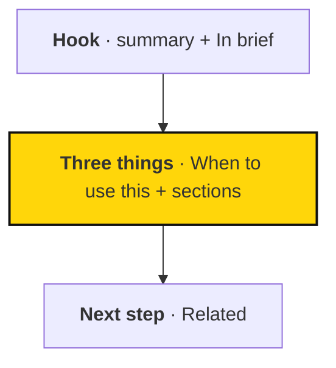
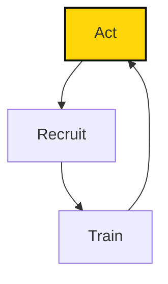

# Handbook style guide

People read this handbook between other things: on a phone before a gathering, or in a spare ten minutes after a meeting. Every page has to earn their attention fast.

This guide sets out how we do that. It covers **framing, wording, and visuals**, and it applies at every level, from the homepage down to a single paragraph. [CONTRIBUTING.md](CONTRIBUTING.md) covers the mechanics: where files go, which blocks exist, and how to build.

## Three principles

**Lead with the point.** Put the idea first, then the detail. A reader who stops after one sentence should still leave with something useful.

**Show the shape.** Group ideas in threes, mark each group with a bold lead-in, and draw the flow when there is one. Readers should see how a page is built before they read it.

**Make every word work.** Cut what the reader doesn't need. Vary the rhythm so the words that remain are a pleasure to read.

## One pattern at every level

The handbook is fractal. The same three-part shape repeats at every scale, and at the topic-page level it's now a fixed anatomy: a self-describing **H1**, a one-sentence **summary** (the `>` line directly under the H1), **`## In brief`** (3–5 bullets), **`## When to use this`**, the main content, then **`## Related`**. That anatomy *is* hook / three things / next step, made literal so both people and tools can rely on it:

1. **Hook.** The summary line and `## In brief` — why should the reader care, and what's the gist if they read no further?
2. **Three things.** `## When to use this` plus the main `##` sections — the core ideas, steps, or choices, grouped so they stick.
3. **Next step.** The `::: related` block at the end.



| Level | Hook | Three things | Next step |
| --- | --- | --- | --- |
| Homepage | Hero tagline | Subject-based routing cards (New here? / Doing the work? / Organizing locally? / Looking for current information?) | "Start here" and "Find anything" buttons |
| Section overview | Summary + `## In brief` | Pages grouped under bold headings | Related block or first page |
| Topic page | Summary + `## In brief` | `## When to use this` plus two to four more `##` sections | Related block |
| Section of a page | First sentence under the heading | Bold lead-ins or a three-item list | A link or an action |
| Paragraph | Bold lead-in | Up to three supporting sentences | — |

Work top-down. Fix the homepage and overviews first, then the openings of topic pages, then paragraphs. A strong frame makes every lower level easier to write. The conceptual Join → Learn → Organize → Build → Act → Grow journey survives only as the homepage's closing section, not as the sidebar's organizing principle — see [AI-READABILITY-PLAN.md](AI-READABILITY-PLAN.md).

## Names

**This section is superseded by [AI-READABILITY-PLAN.md](AI-READABILITY-PLAN.md) for H1s and sections; read that file first.** A page title (H1) is no longer capped at three words — it's a short, self-describing sentence a reader (or an AI, or a search engine) can understand out of context, with no page around it: "How Sapiens First uses metrics", not "Metrics". Frontmatter `title:` repeats the H1 exactly. The old three-word H1 rule and "name the thing, not the activity" still guide the **sidebar label**, which stays short (see below); it's the H1 that changed.

| Level | Form | Examples |
| --- | --- | --- |
| Section (sidebar group) | A subject category, not a verb | Start here, Running the work, Field guides |
| Page title (H1) | A self-describing sentence, meaningful out of context | "How Sapiens First manages work", "The Sapiens First Fellowship" |
| Sidebar label | A short noun phrase, three words or fewer | First steps, Projects, Starting a local circle |
| Heading (`##`) | An action or a promise | Start with a scope, Offer a next step |

On the site, a page's section still shows as the small label above its title, but the sidebar itself groups pages by these subject categories rather than by the six verbs. A page's sidebar label is what appears in the navigation tree and in Related blocks; its H1 is what appears at the top of the page, in `llms.txt`, and in a search result.

### Sections are subject categories

The sidebar (`docs/.vitepress/config.mts`) is grouped by the frontmatter `section` value, in this fixed order: **Start here · About Sapiens First · People and organization · Running the work · Field guides · Reference.** These are subjects a newcomer would search for, not verbs of a journey.

The six verbs — **Join, Learn, Organize, Build, Act, Grow** — still exist, but only as the conceptual journey shown on the homepage (`docs/index.md`), not as sidebar or folder groupings. Folders and URLs keep their original names (`guide/`, `strategy/`, `organization/`, `work/`, `practices/`, `learning/`), so links people have already shared keep working; see the mapping from folder to section in [AI-READABILITY-PLAN.md](AI-READABILITY-PLAN.md).

### Naming a new page

**Write a self-describing H1.** Someone should understand what the page is about from the H1 alone, with no other context — "Reviewing metrics together", not "Reviews" or "Overview".

**Keep the sidebar label plain and short.** Use the word a newcomer would search for. Add an article only when it reads more naturally ("The Fellowship"). Never use "Overview" alone as a label.

**Keep one name for each purpose.** The H1 stays the same everywhere it's quoted in full; the sidebar label stays the same everywhere it's used as link text. `scripts/check-rewrite.py` checks that list-style link text (as in Related blocks and overviews) matches one of the two.

## The rule of three

Three is the smallest number that forms a pattern and the largest most people hold without effort. "Learn · Organize · Act" works for that reason.

**Group long lists into three.** Five or six items become three labelled groups. The Field guides, for example, sort into Act, Recruit, and Train.

**Write triads in openers and taglines.** "Democracy, prosperity, and security" lands harder than a long sentence that covers the same ground.

**Don't invent a third item.** Two real points beat three padded ones. If the third item is weaker than the others, cut it. If there are truly four steps, keep four and use a numbered list.

## Bold lead-ins

Start key paragraphs and list items with a short bold phrase that states the idea. Then explain it.

| Before | After |
| --- | --- |
| It's important to remember that you don't need to read the whole handbook before getting involved, as each page begins with the basics. | **Start with the basics.** Every page opens with what you need to act. Details are there when you want them. |

- **Make it a claim, not a label.** "Start small" tells the reader something. "Scope" does not.
- **Keep it to two to six words.** End it with a full stop, and put the rest in normal weight.
- **Pass the skim test.** Reading only the bold text should give the gist of the section.

Use at most one bold phrase per paragraph. Don't bold words mid-sentence for emphasis; if a sentence needs rescuing, rewrite it.

## Tight, musical sentences

Gary Provost's advice in *100 Ways to Improve Your Writing* is the model: vary sentence length. Several short sentences in a row sound choppy. Several long ones become a drone. Mix them. A short sentence lands a point. A longer one carries the reader through an explanation and gives them room to breathe before the next short one hits.

**Read it aloud.** If you stumble or run out of breath, rewrite the sentence.

**Keep it active and personal.** Write "you" for the reader and "we" for Sapiens First. Say who does what: "the circle reviews the metrics", not "metrics are reviewed".

**Cut to the bone.** Aim for sentences under 25 words and paragraphs of four sentences or fewer. One idea per sentence; one topic per paragraph.

| Instead of | Write |
| --- | --- |
| in order to | to |
| It is important to note that… | *(cut it and state the point)* |
| make a decision / provide support | decide / support |
| is able to, has the ability to | can |
| at this point in time | now |
| utilize, facilitate (as a verb for "help") | use, help |
| a number of | some, several, or the actual number |
| basically, really, very, just | *(cut)* |

## Framing that invites

**Open with the reader's why.** "Good work starts with a clear purpose" is better than "This section describes our work planning framework."

**Make headings promises or actions.** Prefer "Find your starting point" or "Choose a useful next step" to "Overview" or "Information". A reader scanning only the headings should know what they'll get.

**Be warm, not breathless.** Enticing means concrete and useful, not hyped. Avoid stacked exclamation marks, superlatives, and claims we can't support. Our tone is welcoming, direct, and honest about what isn't settled yet.

## Diagrams and visuals

A picture earns its place when it shows a shape that prose hides.

| Shape in the content | Use |
| --- | --- |
| Steps that repeat (a cycle) | Mermaid flowchart with an arrow back to the start |
| A sequence of three or more steps with branches or hand-offs | Mermaid flowchart |
| A hierarchy (mission → project) | Mermaid flowchart, top to bottom |
| A comparison across the same attributes | Table |
| A lookup ("if you are… start here") | Table |
| A simple sequence without branches | Numbered list |

Write diagrams as fenced `mermaid` blocks. The site draws them in the handbook's palette and frames them like our cards.

````md

````

- **Keep it small.** Three to seven boxes, with labels of four words or fewer. Draw top to bottom (`flowchart TB`); a sideways row shrinks to nothing on a phone. The exception is a decision that fans out into several branches: draw it left to right (`flowchart LR`) so the branches stack.
- **Highlight one thing.** Use the yellow `accent` class on at most one box: the start, or the step the page is about.
- **Say it in words too.** Introduce every diagram with a sentence and keep the essential information in the text. Screen readers and search can't read the picture.

One diagram per page is usually right. Put it where the reader first needs the big picture.

## Page recipes

**Section overview.** One- or two-sentence hook. A diagram if the section describes a flow. Then the section's pages grouped under three bold lead-ins, each link followed by a dash and its description.

**Topic page.** An opening paragraph that says what the page helps with and why it matters. Two to four `##` sections whose headings are actions or promises. Essential expectations in plain text; depth in labelled blocks. End with a Related block.

**Glossary entry.** The term in bold, a one-sentence definition, and a link to where it's explained.

## Before you publish

Run three quick passes over your change:

1. **Skim.** Read only the headings and bold text. Do they tell the story?
2. **Tighten.** Read it aloud. Cut every word that doesn't change the meaning.
3. **Show.** Is there a flow, cycle, or hierarchy that a diagram or table would make obvious?

Then follow the build check in [CONTRIBUTING.md](CONTRIBUTING.md#check-before-publishing).
