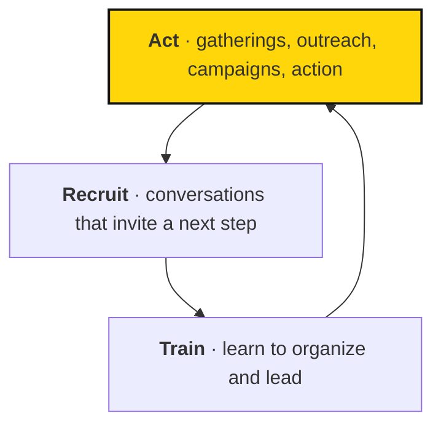

# 1.2 Strategy

## Summary

We believe public participation and organizing capacity can help shape AI toward democratic renewal, common prosperity, and a secure future. Our approach is a repeating cycle: act, recruit, train. Each turn should help more people participate and lead the next turn. Growth and political progress are strategic aims; they are not guaranteed results of running activities.

<!-- Source provenance: maintenance/HANDBOOK-OUTLINE.md, 1.2; docs/strategy/index.md; docs/practices/index.md; docs/learning/strategic-hypotheses.md; 10-2 content additions/Tech Team Notes.md and supplied movement-flywheel.svg. docs/strategy/index.md cycle diagram, worked example, three kinds of work, theory-of-change paragraph and Stop 1984 background carried in (2026-09-29). Rewritten 2026-10-02. Organizational beliefs and source ambitions are presented as such; this draft does not adopt new targets, tooling, or review procedures. -->

## 1.2.1 Our theory of change {#theory-of-change}

We believe the direction of AI can still be shaped through collective action. Community work brings people into relationships and shared activity. Invitations help them take on responsibility; training helps them organize and lead. Empowerment and advocacy turn that growing capacity toward political change.

The intended connection is between participation, capacity, and outcomes. An event can welcome people and create relationships, but attendance alone does not establish political influence. Our strategy needs to explain how those relationships support work toward the change we seek. Current campaigns, priorities, and owners belong in [Atlas](https://sapiensfirst.org/atlas).

Each turn of act, recruit, train should bring in more people who can lead the next turn, compounding our capacity before powerful AI's effects become hard to reverse.

::: source
Atlas records the current mission structure, campaign priorities, and who owns them. This page explains the strategy and cycle behind that structure.
:::

## 1.2.2 Act {#act}

Gatherings, outreach, campaigns, and peaceful actions give people something meaningful to do together. Choose an activity with a clear purpose and a useful next step for participants. Favor activities that help volunteers recruit more volunteers; that is a growth ambition we test in practice.

Use the [gatherings guide](../appendices/reference/field-guides/gatherings.md) and [peaceful actions guide](../appendices/reference/field-guides/actions.md) for practical preparation. Follow the [values and red lines](culture.md#behavioral-commitments-and-red-lines) and [decision rights](structure.md#roles-circles-decision-rights) when choosing and carrying out work.

## 1.2.3 Recruit {#recruit}

Recruitment grows through relationships, listening, invitations, and follow-up. Help someone find a next step that fits their interests and capacity. Joining an activity can lead to a small responsibility, then to helping others participate.

The [organizing conversations guide](../appendices/reference/field-guides/organizing-conversations.md) provides a practical starting point, and [2.3.1 The Organizer Conversation](../leadership/people.md#organizer-conversation) explains why it matters. Use the [local circle guide](../appendices/reference/field-guides/starting-a-circle.md) when a group is ready to organize together.

## 1.2.4 Train {#train}

Training helps people practice organizing and leadership, receive feedback, and support others. The purpose is to grow the number of people who can carry responsibility for the next actions and invitations.

Use the [training guide](../appendices/reference/field-guides/training.md) and [feedback guidance](../leadership/culture-in-leadership.md#feedback-culture). Look for what participants can do after training, including whether they can help someone else learn. Course completion alone does not show that organizing capacity has grown.

## 1.2.5 How the cycle compounds {#how-the-cycle-compounds}

[Open the movement flywheel at full size](/diagrams/movement-flywheel.svg).

In text: actions reach supporters; invitations and follow-up help people become members; training and support help people become organizers. Those organizers can lead further actions and invite others into the cycle. Shared activity data can inform learning and strategy. The diagram's proposed channels and systems, including an app, courses, dues, and a company brain, do not establish that those tools or programs are available or adopted.

**Act, recruit, train.** Our approach is a cycle. Each activity feeds the next, so every turn brings in more people who can lead.

Here's how it looks for one person. They come to an event and meet people. They take on a small responsibility. Soon they're helping the next person get involved.

**How the work fits together.** Three kinds of work build on each other:

- **Community** builds participation and lasting relationships.
- **Empowerment** gives people the knowledge and confidence to lead.
- **Advocacy** turns that capacity toward political change.

Shared direction, governance, resources, and support hold it all together. Atlas records the current structure, including the pillars and the programs and work linked beneath the mission.

The cycle can compound when people stay involved, take responsibility, and help others lead. Recruitment without retention or support can leave the movement with more contacts and little additional capacity.

We aim for exponential growth. The cycle illustrates a possible mechanism for it, not a measured growth rate or a promise. For the proposed technical support, see [3.4.1 Tech team: strategy primer](../staff/department-specific-guidance.md#tech-team-strategy).

## 1.2.6 Assumptions and strategic choices {#assumptions-and-strategic-choices}

Our strategy assumes that participation can become organizing capacity and that capacity can support political change. We need to check each connection against actual results. Political conditions, relationships, resources, retention, and leadership capacity can all affect what happens.

For a particular activity, state the intended outcome and the assumption connecting the work to it. If invitations increase but sustained participation does not, examine the invitation and onboarding approach. If more people complete training but few lead activities, examine what practice and support they need. These are examples of questions for learning, not adopted performance thresholds.

Use [strategic hypotheses](../leadership/strategic-planning.md#strategic-hypotheses), [metrics](../leadership/strategic-planning.md#metrics), and [reviews of strategy performance](../leadership/strategic-planning.md#reviewing-performance-of-the-strategy) in [2.2 Strategic planning](../leadership/strategic-planning.md) to develop and assess a plan.

::: background Assumptions, evidence, and strategy

Our movement guide names mobilizing 3.5% of the population as an ambition. Treat a participation target as a strategic ambition, not a guarantee that reaching a percentage will produce political change.

Our growth depends on more than recruitment. Retention, leadership capacity, relationships, resources, and political conditions matter too. We need to test our assumptions and learn from actual results.

The Fellowship's initial strategy used a California campaign against mass surveillance, “Stop 1984!”, as a concrete starting point. The broader lesson is to choose work that matters, offers a plausible path to progress, and builds capacity for what comes next. Current campaign priorities belong in Atlas and the [campaign pages](https://sapiensfirst.org/campaigns).
:::

## Further Reading

[B.4 Movement best practices](../further-reading/movement-best-practices.md) and the rest of [B Further Reading](../further-reading/index.md) offer movement and strategy resources.
