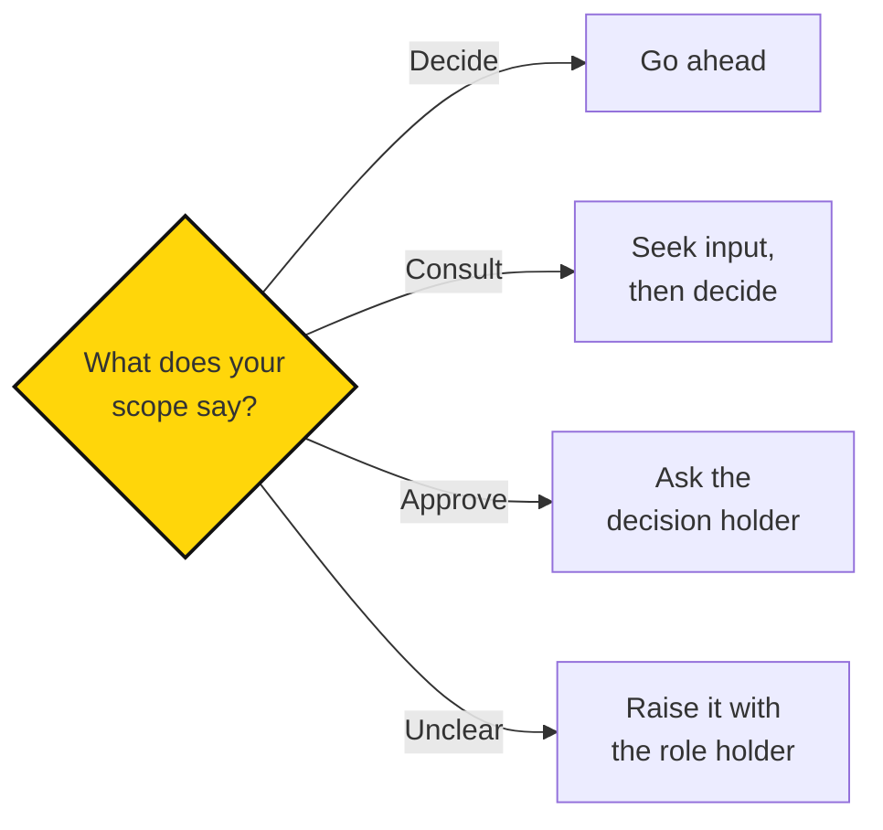
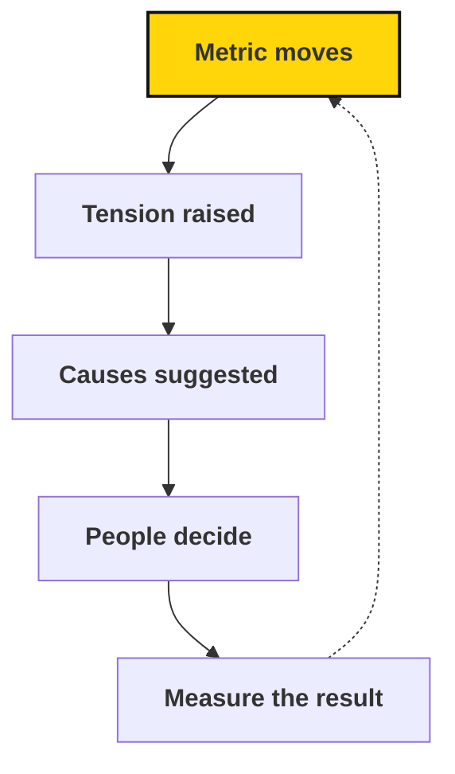

# 1.4 Structure

## Summary

Sapiens First organizes through roles and circles so people can act with context and purpose without depending on one leader. Atlas records the current structure; this page explains the concepts. Some parts are not settled yet: we have no adopted Holacracy constitution or process for changing the structure, and no agreed definitions for chapters and hubs.

<!-- Source provenance: maintenance/HANDBOOK-OUTLINE.md, 1.4; docs/organization/roles-and-circles.md (2026-09-27); docs/organization/decisions.md (2026-09-28); docs/organization/participation.md (2026-09-29); docs/practices/starting-a-circle.md (2026-09-28); docs/learning/atlas-and-ai.md (proposal, 2026-09-27); docs/organization/index.md (2026-09-29). Tables, Atlas role fields, handover guidance, decision-rights steps, participation and movement-architecture tables, and the Atlas and AI proposal are carried in from those pages with their wording retained; framing rewritten 2026-10-02. Legacy Fellow/Steward/Lead terms are mapped to IC/DRI/Player-Coach in 1.4.4. -->

This page answers three questions. **What do we stand for?** Our values set the boundaries for acting in the name of Sapiens First; see [1.3 Culture](culture.md). **Where do you fit?** Everyone starts somewhere, and responsibility grows as you take it on; see [1.4.4](#participation-responsibility-employment) and [1.4.2](#roles-circles-decision-rights). **How do decisions get made?** Know what you can decide, when to consult, and when to ask; see [1.4.2](#roles-circles-decision-rights).

Find current roles, circles, and assignments in [Atlas](https://sapiensfirst.org/atlas).

::: source
Atlas holds current roles, circles, and assignments. This page explains how they work.
:::

## 1.4.1 Why Holacracy and distributed authority {#why-holacracy}

The movement guide draws on Holacracy: explicit roles, distributed responsibility, and a process for addressing unclear or changing responsibilities. The aim is to let people act with context and purpose while reducing dependence on a single leader.

We have not adopted a complete Holacracy constitution or decision procedure. Use recorded decision rights and current agreements. Don't infer formal authority from the word "Holacracy."

## 1.4.2 Roles, circles, accountabilities, and decision rights {#roles-circles-decision-rights}

**Roles.** A role is a defined responsibility with a purpose, accountabilities, and a scope. People may hold multiple roles, and who fills a role can change without changing the responsibility itself.

**Circles.** A circle brings roles together around a shared purpose. A circle is a group of roles, while a program or product is an area of work; the two can be linked without being the same thing.

**Decision rights.** Every scope should mark choices as Decide (you choose alone), Consult (seek input, then decide), or Approve (someone else decides). The decision holder for a role or project should be recorded in Atlas.

Atlas holds current purposes, accountabilities, scopes, assignments, and linked work. The paragraphs below explain how to read a role in Atlas, how circles and work relate, how a role changes hands, and how to work through a decision.

**Reading a role in Atlas.** Clear roles help people act without asking one person for everything, and the responsibility should stay understandable when the person filling it changes. Atlas records each role through these fields:

| Field | What it tells you |
| --- | --- |
| Purpose | Why the role exists |
| Accountabilities | Its ongoing responsibilities |
| Scope | The area of work described for the role |
| Privileges | Recorded access rights |
| Parent circle | Where the role sits in the organizational structure |
| Assignment | Who currently fills it |
| Linked work | Work the role is recorded as responsible for |

Missing access details mean they haven't been documented. Linked work records responsibility; it does not by itself grant formal Holacracy authority or system access.

::: source
Atlas holds the current roles, circles, and who fills each one. This page explains what a role and a circle are and how to read them.
:::

**How circles and work relate.** Atlas holds two related views: how responsibilities are organized (circles and roles), and how work contributes to the mission (programs, products, and projects).

This distinction helps when responsibilities change. A product can continue even when its owner or supporting circle changes. For the kinds of work records Atlas uses, see [2.2.1 From mission to work](../leadership/strategic-planning.md#from-mission-to-objectives).

**Taking on or handing over a role.** Review the purpose, responsibilities, linked work, access needs, and available capacity with the person coordinating the assignment. Make sure Atlas reflects the current assignment.

When handing over, leave the next person the relevant files, context, open decisions, and next steps. Explain what needs attention soon. For what to leave behind when a project changes hands, see [Finish and hand off](../leadership/strategic-planning.md#project-execution-and-handoffs).

**Checking decision rights.** Before starting work, agree on what you can decide, what needs consultation, and what needs approval. People need room to act and clarity about when to involve others. Your role and project scope are the starting points. Here's how to work through a decision:

Consultation and approval are different. Be clear about which you're asking for and who will make the final decision.

Authority over a project is set in its scope, which names the owner and records which choices they decide, consult on, or need approved. Atlas records the current owner and decision holders. For the scope template, see [Project scope](../appendices/reference/planning-templates.md#project-scope).

**Current practice for project decisions.** Fellows (individual contributors; see [1.4.4](#participation-responsibility-employment)) review project scope and plans with Rohan. Also discuss these with him where approval or a decision is needed: spending, public communications, external commitments, major scope or deadline changes, and important blockers.

As we distribute responsibility, record the actual decision holder in the role or project records. A change in the handbook's wording alone doesn't transfer authority.

## 1.4.3 Governance and changing the structure {#governance-and-change}

A repeatable governance process for changing roles and circle responsibilities is a proposal, not yet adopted.

**When responsibility is unclear.** Describe the problem, the work it affects, and the decision you need. Raise it with the relevant role holder or circle contact. Keep a short record of the agreed resolution where others doing the work can find it.

If you can't identify the right person, ask your onboarding or Fellowship contact to help find them.

::: proposal Changing roles and circle responsibilities

A repeatable governance process could let people bring a concrete tension, propose a change to a role or circle, consider effects on others, and record the agreed change in Atlas.

Before adopting this process, we need to settle who can approve changes, how disagreements are resolved, how decisions take effect, and who updates the record. Until then, follow the current decision rights and agreements.
:::

## 1.4.4 Participation, responsibility, and employment {#participation-responsibility-employment}

You can contribute in different ways at different points in your life; choose a level that fits your interests and capacity. Participation and role are different things. A program like the Fellowship describes participation. "Website Owner" describes a role. One person may hold more than one role.

**Governance roles.** A role is a specific responsibility. A role title alone doesn't establish permissions or authority.

**Employment.** Staff status is a separate concept from participation level and governance role. See [3.0.4 What counts as staff?](../staff/beliefs-about-staff.md#what-counts-as-staff)

**Ways to participate.** There are three main ways to participate: Supporter, Member, and Organizer.

| Way to participate | What it involves |
| --- | --- |
| Supporter | Stay informed and join activities when you can |
| Member | Participate in the community, help with events, and build connections |
| Organizer | Take responsibility for work, from a project to leading other people; see the role types below |

Check the current joining process for membership terms, dues, and eligibility. The handbook isn't a record of current prices or program dates.

To take a first step at any level, see [0.3 Getting involved](../introduction/getting-involved.md).

**Movement architecture.** The movement architecture is a product roadmap for growing the movement. Each rung of the ladder of engagement has a definition, subcategories, and systems that recruit people onto it and keep them on it. Understanding it helps explain how we prioritize work: we build the systems that move people up the ladder.

| | Supporter | Member | Organizer |
| --- | --- | --- | --- |
| **Defining feature** | Email on the list | Registered as a member and paid dues at least once | Applied and accepted into a Course |
| **Info we hold** | Email, zip code | Email, address (line, city, state, zip code, country), full name, phone number | See Atlas |
| **Subcategories** | Supporters; donors | Active; inactive | Individual Contributor (legacy: Fellow); Directly Responsible Individual (legacy: Steward); Player-Coach (legacy: Lead) |
| **Recruitment systems** | Media stunts; door-to-door; flyers; open letters; bought lists; event apps (Luma, Partiful); social media followers | Open events; membership free trial | Application |
| **Retention systems** | Emails | Discord; events; text reminders; email reminders; member-only events | Courses; coaching; app; socials |

The ladder groups the ways to participate above. Atlas holds the current state of each system.

::: source
Atlas holds current membership terms, role assignments, and engagement levels. This page explains what each way of participating means.
:::

**Organizers and role types.** "Organizer" is the umbrella term for people who take responsibility for work. Organizers hold one or more of three role types, defined in [3.1 Expectations](../staff/expectations.md). You may still meet the older titles Fellow, Steward, and Lead; they map as follows:

| Older title | Role type | Where it is defined |
| --- | --- | --- |
| Fellow | Individual Contributor (IC) | [3.1.1](../staff/expectations.md#individual-contributor) |
| Steward | Domain owner / Directly Responsible Individual (DRI) | [3.1.2](../staff/expectations.md#directly-responsible-individual) |
| Lead | Player-Coach (PC) | [3.1.3](../staff/expectations.md#player-coach) |

Role types are not mutually exclusive positions or a managerial ladder: one person can hold more than one ([3.1.4](../staff/expectations.md#mixed-roles)). A Fellow takes responsibility for a project through the supported volunteer [Fellowship](../introduction/getting-involved.md#volunteer-and-fellowship-pathways). "Steward" described a further engagement level for Fellows after three months and graduation, separate from any role with "Steward" in its title. A title alone doesn't establish permissions or authority.

**Keep role and participation separate.** Leading a team is a responsibility, not a requirement that everyone must progress toward. Continuing as an individual contributor can be a valuable choice.

::: roles Taking on a role

Taking on a role means agreeing to its purpose and ongoing responsibilities. Discuss the time involved and the support you need before committing. Find your current assignments in Atlas and raise a mismatch if the record doesn't reflect your actual work.
:::

## 1.4.5 Local circles and movement growth {#local-circles-and-growth}

Every local group starts as a circle. Hubs, chapters, and alliances are ideas for later stages of local growth; their definitions, thresholds, and procedures aren't adopted yet, so they aren't rules.

See [Starting a local circle](../appendices/reference/field-guides/starting-a-circle.md) for the practical starting sequence.

## 1.4.6 Atlas and the handbook {#atlas-and-the-handbook}

The handbook explains concepts; [Atlas](https://sapiensfirst.org/atlas) holds the live structure, including roles, circles, and assignments. Where the two differ, check Atlas for current assignments and raise the mismatch.

**Atlas and AI: the proposed shared data system.** The rest of this section describes where we're heading, not current features or requirements.

As we grow, keeping everyone informed gets harder. More chapters and projects usually mean more meetings, more reports, and more people whose main job is passing information along. We want to grow without that overhead growing at the same rate.

Our aim is for [Atlas](https://sapiensfirst.org/atlas) to give everyone a shared, current picture of the movement, and for AI to help us make sense of it. That means answering basic questions about the work, turning everyday records into metrics, and noticing what needs attention before someone has to ask. People should be able to act with context instead of waiting for it to reach them through layers of coordination.

::: source
Atlas records what currently exists: mission, work structure, roles, circles, and assignments. This section describes a proposed future, not Atlas's current features.
:::

**The questions Atlas should answer.**

- What are we trying to achieve?
- Who is responsible for it?
- What's happening?
- Is it working?
- What needs attention, and what should happen next?

Answering these needs four connected kinds of records:

| Layer | Records | Answers |
| --- | --- | --- |
| Organization | People, roles, circles, accountabilities | Who is responsible |
| Strategy | Objectives, key results, metrics | What we're trying to achieve, and whether it's working |
| Work | Programs, projects, tasks, events | What's happening |
| Learning | Tensions, suggestions, decisions | What needs attention and what to do next |

When these are linked, responsibility is clear without anyone having to piece it together from documents. A key result links to a metric, the metric to the circle responsible for it, and the circle to the projects working on it.

**Get metrics from the work itself.** We want metrics to come from the ordinary records of doing the work, not from extra reporting. When someone signs up, attends an orientation, or joins a chapter, that step is already recorded somewhere. So is a project finishing or a role being filled. Atlas can calculate recruitment, retention, and project results from those records, so nobody has to count by hand.

These are records of organizational steps that people already expect us to keep. They aren't a way of tracking anyone's personal activity.

This also lets Atlas keep each metric's history. With a history, we can see trends instead of isolated numbers.

**From a signal to a decision.** Once Atlas knows what we're aiming for, who's responsible, and how the numbers are moving, AI can help us notice what needs attention sooner. Here's how that loop should work:

1. A metric moves outside its expected range.
2. Atlas raises it with the responsible role or circle as a **tension**: a gap between how things are and how they could be.
3. It suggests likely causes and possible next steps, with the evidence behind them.
4. The responsible people decide what to do.
5. We measure whether it helped, and learn from the result.

::: example
**Growth objective at risk.** Sign-ups rose 50% over four weeks, but orientation attendance fell from 72% to 41%. Many new members waited more than three days for a scheduling link. Likely bottleneck: orientation capacity. Relevant role: onboarding lead. Possible next steps: make scheduling easier and add a second weekly session.
:::

That's more useful than a red number on a dashboard. It points to a cause, a responsible role, and a next step, and it leaves the decision with people.

Recording tensions, decisions, and their results also builds a memory of what works. Over time, we can learn which approaches actually help.

**Helping organizers do more.** The purpose of AI here is to give organizers more time for the work only people can do: conversations, relationships, and leadership. It can help by:

- Taking on routine follow-up people have agreed to hand over, like reminding a new sign-up to choose an orientation time.
- Preparing a summary of the metrics and open tensions before a circle's review.
- Drafting updates, plans, and handoff notes from existing records.
- Suggesting where a role or circle could use more support.

We'll start with suggestions that people approve. Routine, low-risk tasks can move to automatic handling once we trust them. Decisions about people, priorities, and resources stay with people.

**Know the limits.**

- AI helps us notice and understand. People make consequential decisions, especially about roles, commitments, and anyone's contribution.
- Atlas shouldn't produce performance scores for individuals. A declining number prompts a check-in, as described in [Metrics and people](../leadership/strategic-planning.md#reviewing-performance-of-the-strategy).
- We only record what we need for the work, and we aim to be clear about what's recorded and why.
- Private organizational information stays out of tools that aren't authorized for it.

::: background Why this matters for how we organize

In *From Hierarchy to Intelligence*, Jack Dorsey and Roelof Botha argue that much of traditional management exists to move information. It collects context from below, relays decisions from above, and keeps teams aligned. They suggest AI can increasingly do that routing, leaving people to own outcomes and develop one another.

This fits the idea behind our roles and circles ([1.4.2](#roles-circles-decision-rights)): distributed responsibility, explicit roles, and people acting with context rather than depending on a single leader. We're drawing on the idea, not adopting any particular company's structure.
:::

## Further Reading

See [B.5 Holacracy and facilitation](../further-reading/holacracy-and-facilitation.md) and the rest of [B Further Reading](../further-reading/index.md).
