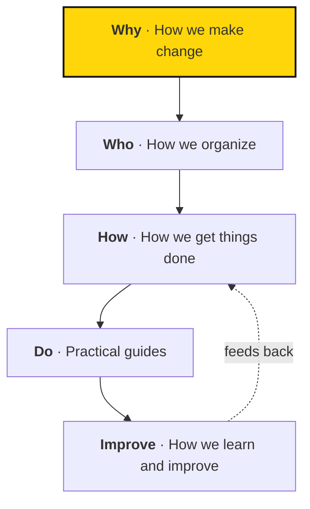

# Welcome to Sapiens First

We imagine a world where AI serves the common good. We fight for **democracy, prosperity, and security** in the age of AI, and we're glad you're here.

This handbook helps you do three things: understand the movement, find your place in it, and get things done with others. Whether you're coming to your first gathering, starting a circle, or leading a project, start here.

## Find your starting point

| If you are… | Start here |
| --- | --- |
| Curious about the movement | [Our mission and approach](../strategy/index.md) |
| Joining as a member | [Getting started](getting-started.md) |
| Joining the Fellowship | [Being a Fellow](fellowship.md) |
| Starting or supporting a local group | [Starting a circle](../practices/starting-a-circle.md) |
| Taking on a role, including as staff | [Roles and circles](../organization/roles-and-circles.md), then [How we get things done](../work/index.md) |

## Read it in layers

**Start with the basics.** Every page opens with what you need to act. You don't need to read everything at once.

**Open the details when you need them.** Collapsible sections labelled **For role holders** or **Background** hold the extra depth.

**Look up any term.** The [glossary](glossary.md) explains the words we use.

## How the handbook fits together

The handbook follows the path from purpose to practice. Each section answers one question, and what we learn feeds back into how we work.

- **Why:** [How we make change](../strategy/index.md) — our mission, theory of change, and policy focus.
- **Who:** [How we organize](../organization/index.md) — values, participation, roles, and decisions.
- **How:** [How we get things done](../work/index.md) — objectives, projects, and weekly work.
- **Do:** [Practical guides](../practices/index.md) — circles, gatherings, training, and actions.
- **Improve:** [How we learn and improve](../learning/index.md) — metrics, reflection, and feedback.

## The handbook and Atlas

**The handbook explains; Atlas records.** The handbook covers our shared concepts, expectations, and practices. [Atlas](https://sapiensfirst.org/atlas) is the source of truth for current governance, work, priorities, and owners.

| The handbook tells you… | Atlas tells you… |
| --- | --- |
| What a role means | Who holds it now |
| How to plan a project | Which projects are live, and their records |
| How decisions get made | Who currently decides what |

If a record is missing or unclear, ask the relevant role holder. An empty field doesn't mean a decision has been made.

## A handbook that grows with us

Some practices are already in use. Others are still taking shape as we prepare for more people to join. Two labels keep them apart:

- **Proposal** describes a possible future practice, not an adopted rule.
- **To clarify** marks a decision we still need to make.

Both have a dashed border, so they're easy to tell apart from current practice.

Found something confusing? Tell the person responsible for that area, or suggest an edit. Every fix makes it easier for the next person to join in.
