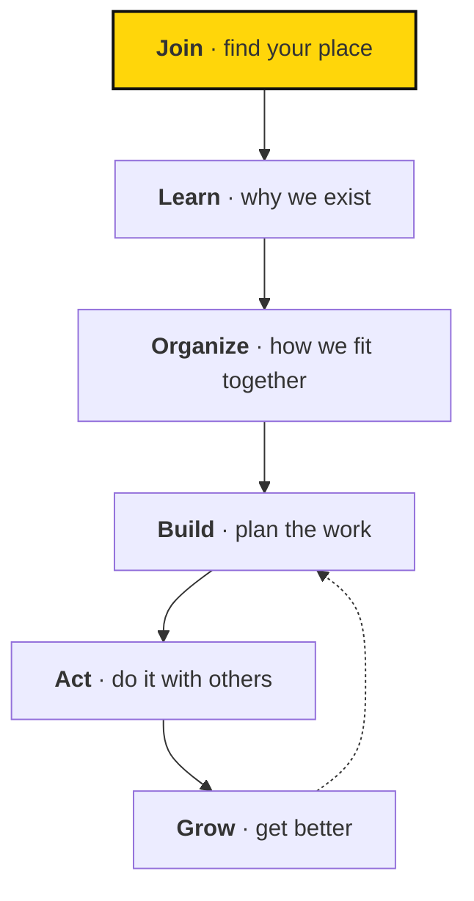

## A journey from supporter to organizer

You can understand Sapiens First as a journey from supporter to organizer, but the handbook navigation is organized by subject so information is easy to find.

- **Join** — find your place. [Welcome](/guide/)
- **Learn** — understand why we exist. [Mission and strategy](/strategy/)
- **Organize** — see how we fit together. [How we're organized](/organization/)
- **Build** — plan the work. [How we manage work](/work/)
- **Act** — do it with others. [Field guides](/practices/)
- **Grow** — get better. [Measuring and learning](/learning/)

Can't find what you're looking for? [Find anything](/find) routes common questions straight to their answer.
