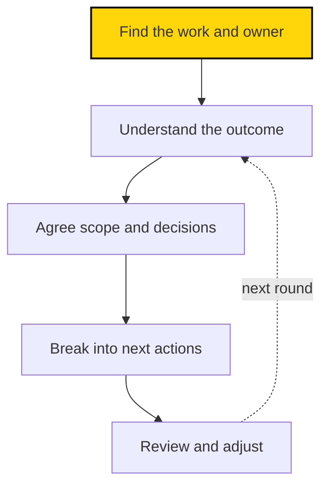
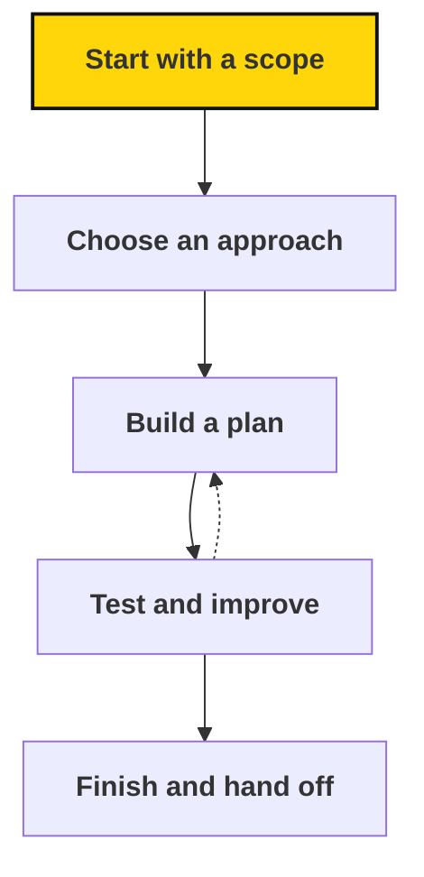
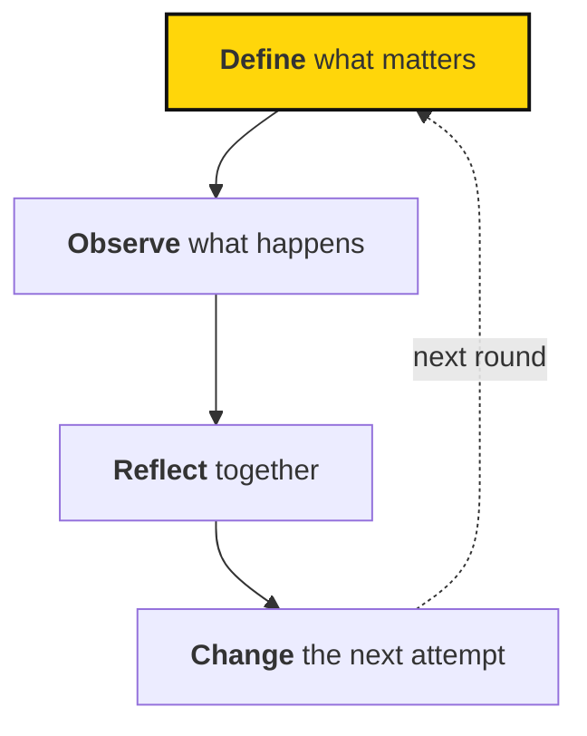

# 2.2 Strategic planning

## Summary

Strategic planning connects the mission to the work people do this quarter and to the evidence that tells us whether it is working. This page carries the concepts and the practical methods: the mission-to-work records, objectives and metrics, strategic hypotheses, how projects are scoped, planned and handed off, a proposed weekly routine, and regular metric review. Copyable templates live in [A.2.1](../appendices/reference/planning-templates.md). It does not adopt a planning cadence, owners, or a work hierarchy; those are marked where they are still needed. [1.2 Strategy](../dna/strategy.md) holds the durable strategy and its assumptions.

<!-- Source provenance: docs/work/index.md (adopted, 2026-09-28), docs/work/projects.md (adopted, 2026-09-28), docs/work/weekly-work.md (proposal, 2026-09-27), docs/learning/index.md (adopted, 2026-09-27), docs/learning/metrics.md (adopted, 2026-09-28), docs/learning/reviewing-metrics.md (adopted, 2026-09-27), docs/learning/strategic-hypotheses.md (adopted, 2026-09-27); docs/work/templates.md via A.2.1; maintenance/HANDBOOK-OUTLINE.md, 2.2. Practical content carried in with wording retained (tables, examples, diagrams, proposals); Atlas and AI is at 1.4.6; framing written 2026-10-02. -->

Good work starts with a clear purpose. Before you take on a task, know three things: **who it helps, what should change, and how it moves the mission forward.** Learning runs as a loop: define what matters, observe what happens, reflect together, and change the next attempt ([2.2.7](#reviewing-performance-of-the-strategy)). The handbook explains the approach; [Atlas](https://sapiensfirst.org/atlas) holds the current numbers, and Atlas doesn't yet store metric definitions or results. Evaluation rubrics are still being developed; treat proposals on this page as proposals that need to be discussed and adopted before they become requirements.

## 2.2.1 From mission to objectives {#from-mission-to-objectives}

Durable strategy and current priorities are different things. The theory of change and its assumptions belong in [1.2](../dna/strategy.md#assumptions-and-strategic-choices); current objectives, projects, and owners belong in planning and change as conditions change.

Every piece of work traces back to the mission through pillars, programs, products or services, and projects. [Atlas](https://sapiensfirst.org/atlas) records current work and who's responsible.

::: source
Atlas lists current mission, pillar, program, and project records and who owns them. This section explains the concepts behind those records.
:::

**From mission to work.** Every piece of work traces back to the mission. Atlas uses these kinds of work records:

| Kind | Plain-language meaning | Example |
| --- | --- | --- |
| Mission | The overall change we are working toward | Political change around AI governance |
| Pillar | A major contribution to that mission | Empowerment |
| Program | Related work organized around a continuing purpose | Knowledge |
| Product or service | Something people can use or benefit from | A resource center or training offering |
| Project | A bounded effort to create or change something | Develop a workshop |

The examples illustrate the concepts. Look in Atlas for current records and their relationships.

A product or service can need several projects over its life. Finishing a project doesn't necessarily end the responsibility to maintain what it produced.

**Outcomes and outputs.** Three terms keep plans honest:

- **An [objective](../appendices/glossary.md#objective) is a change.** It describes what we want to be different.
- **An output is a thing.** It's something we create.
- **A [key result](../appendices/glossary.md#key-result) is the proof.** It tells us how we'll recognize success.

[Metrics](#metrics) calls that change an **outcome**, and adds **input** for an early, fast-moving measure of effort. A workshop is an output. Participants who can run their first meeting are the outcome. Both matter: we need to deliver the workshop, and find out whether it helps.

Each key result should point to a defined metric, so everyone reads it the same way. Track the outcome, and also the inputs a role can directly influence; [2.2.3](#metrics) explains how.

These match the terms in [Inputs and outcomes](#metrics): an objective names the outcome we want, a key result is the measure that shows that outcome happened, and an output is what we produce along the way. Metrics adds inputs: the early measures of effort.

::: proposal Connecting objectives, products, and tasks

The working notes propose connecting high-level priorities to products, milestones, tasks, and subtasks. Atlas already has a mission, pillar, program, product/service, and project structure. We should clarify the relationship between these before treating them as a single fixed hierarchy.

A useful starting proposal is:

- Objectives describe the outcomes a piece of work should advance.
- Products and services provide continuing value to defined users.
- Projects create or improve those products, services, or other results.
- Milestones mark meaningful progress or a decision point within a project.
- Tasks describe specific next actions; subtasks help when a task needs breaking down.
- Roles and circles hold responsibility for work and review the results.

Objectives may apply at more than one level. Whether they become separate Atlas records, fields, or linked records remains to be decided. Likewise, this proposal does not mean Atlas already supports task assignment or metric tracking.
:::

::: clarify
The working notes propose connecting high-level priorities to products, milestones, tasks, and subtasks, while Atlas already uses mission, pillar, program, product/service, and project records. How these fit together has not been reconciled with Atlas, so this draft specifies no fixed hierarchy or schema.
:::

**Choose a useful next step.** Work moves in a loop. Plan, act, review, and adjust the next round.

1. **Find it.** Locate the relevant work and its owner in Atlas.
2. **Understand it.** Learn the intended outcome and current priority.
3. **Agree on it.** Settle scope, success criteria, and decision rights.
4. **Break it down.** Split the work into milestones and concrete next actions.
5. **Review it.** Look at what happened and adjust the plan.

## 2.2.2 Objectives and key results (OKRs) {#okrs}

An **objective** describes a change; an **output** is a thing you create; a **key result** is the proof that the change happened ([2.2.1](#from-mission-to-objectives)).

**Start from objectives.** An **objective** describes a change we want to achieve. **Key results** tell us how we'll recognize progress. Each key result should point to a clearly defined **metric**, with a starting point, a target, and a date.

::: example
**Objective:** Build a strong Berkeley chapter.

- Reach 100 active members.
- Reach 20 active organizers.
- Keep 30-day member retention at 75% or higher.
- Run four public actions a month.
:::

"Active member" and "30-day retention" need agreed definitions before the key results mean anything. Two people reading the same number should understand the same thing.

This matches [2.2.1](#from-mission-to-objectives): an objective names the outcome we want, and a key result is the measure that shows that outcome happened, usually an outcome metric, paired with the inputs that show where to act.

Start with the outcome you care about. Then ask what you can observe, how you'll collect it, and what you would do differently after seeing the result. If no result would change a decision, you probably don't need the metric.

::: clarify
No adopted OKR practice is established in the source documents. Still needed: whether OKRs are the organization's method; the planning cadence; how baselines, targets, and dates are set; who owns each objective and key result; and who is responsible for reviewing them.
:::

## 2.2.3 Metrics {#metrics}

We use metrics to understand the health of the movement and to decide where to put our limited time, money, and attention. A metric is useful when it helps someone make a better decision; otherwise, don't collect it. Three ideas make that work: start from the objective ([2.2.2](#okrs)), pair inputs with outcomes, and define each measure clearly.

Metrics come in three kinds: an **input** is an early, fast-moving measure a role can directly influence; an **output** is what gets produced; an **outcome** is the change that resulted. We track inputs and outcomes together, because inputs show where to act and outcomes show whether the work is succeeding.

::: source
The handbook defines what a metric means and how it should be read. Atlas holds each metric's current value and history, once it's built to store one; see [1.4.6 Atlas and AI](../dna/structure.md#atlas-and-the-handbook).
:::

Metrics describe the state of our work, not the worth of a person. They come from records the work already produces (sign-ups, attendance, roles filled, projects completed), not from monitoring what individuals do.

**Inputs and outcomes.** Most results come at the end of a chain. For recruitment, it might look like this:

| Stage | Example |
| --- | --- |
| Effort | Organizer hours spent on outreach |
| Activity | Conversations started, events held |
| Output | Sign-ups and applications |
| Early outcome | People who attend an orientation and join |
| Outcome | Members still active after 30 days |
| Strategic outcome | Chapters that can sustain themselves and grow |

The later stages matter most, but they're slow to move and depend on many things at once. The earlier stages are **inputs**: things a role holder can directly influence, and that show up quickly.

**We track both.** The outcome tells us whether the work is succeeding. The inputs tell us where to act. A recruitment lead can control how quickly new sign-ups are contacted; they can't personally guarantee that a chapter reaches 100 members.

Choosing the right input takes testing. If an input rises and the outcome doesn't follow, the input isn't measuring what matters. Revise it.

::: background Why this matters
Hold people responsible for the things they can influence, and review outcomes together. That keeps attention on the work that moves results, and it keeps us honest about what depends on circumstances.
:::

**Pair your measures.** A single number invites people to push on it at the expense of everything else. Pair each measure with one that shows the cost of overdoing it:

- New members, paired with 30-day retention.
- Events held, paired with attendance and follow-up.
- Speed of responding to sign-ups, paired with how many go on to an orientation.
- Projects completed, paired with whether they achieved their success criteria.

A project can be 90% complete and still not produce the result it was meant to. Measure both progress and effect.

**Define a metric.** Write the definition down once, then collect values against it over time. The definition stays stable; the observations build up into a history we can compare.

| Field | What it explains |
| --- | --- |
| Name and purpose | What we measure and what decision it informs |
| Related objective | Which result it helps us understand |
| Type | Input, output, or outcome |
| Definition | The unit, population, period, and calculation |
| Data source | Where the values come from |
| Responsible role or circle | Who maintains it and explains changes |
| Review rhythm | How often it's worth looking at |
| Direction | Whether higher or lower is better |
| Baseline and target | Where we started and what we're aiming for |
| When to look closer | The level or trend that should prompt a conversation |
| Limits | What the metric misses or could misrepresent |

::: example
**30-day member retention**: the percentage of new members who are still active 30 days after joining. An outcome measure, owned by the membership role, reviewed weekly. Higher is better. Look closer below 75%; treat below 60% as urgent. It doesn't tell us *why* people leave. Conversations do.
:::

Link each metric to the objective or area of work it measures, then link responsibility to the relevant role or circle. That keeps the meaning of the measure separate from whoever currently holds the role.

Specific definitions, targets, and results belong in Atlas or the live records linked from it. The handbook holds the approach. Atlas doesn't yet store metric definitions or history; see [1.4.6 Atlas and AI](../dna/structure.md#atlas-and-the-handbook) for where we're heading.

**What we don't measure.**

- We don't track individuals' personal activity, messages, or online behavior.
- We don't give people a single performance score.
- We don't ask volunteers to fill out reports only to produce numbers. If a metric needs manual reporting, ask whether it's worth the time.
- We don't collect data without a decision it's meant to inform.

When someone's work shows up in a metric, the purpose is to notice where support might help. See [Metrics and people](#reviewing-performance-of-the-strategy).

**Models of movement growth.**

::: proposal Models of movement growth

The working notes suggest modeling how recruitment, coaching capacity, active organizers, and chapters affect one another. A model could help us compare possible investments and identify constraints.

For example, more recruits may not lead to more active organizers if nobody has time to welcome and support them. More trained leaders may not produce more chapters without members and ongoing support.

Define each variable, the time period, the assumptions, and the evidence behind it. Compare the model's predictions with actual results and revise it. The notes' “R0” idea is an exploratory analogy, not an established metric or a guarantee of exponential growth.
:::

::: clarify
Citations in the metrics guide still need verification, and the local cadence for setting and revising metrics is unconfirmed. Specific metrics and targets are not adopted by this draft.
:::

## 2.2.4 Strategic decisions and hypotheses {#strategic-hypotheses}

Most plans start from what we already do and ask what to add next. That habit protects the status quo. Working backwards starts from the change you want. Then it asks what would have to be true to get there, a sharper way to choose which inputs deserve attention. Work backward from the outcome you want, state the assumption connecting the work to it, review the evidence, and adjust. [1.2.6](../dna/strategy.md#assumptions-and-strategic-choices) frames the organization-level assumptions.

**Start from the outcome, not the activity.** Pick the outcome first: a chapter that sustains itself, a steady stream of members still active after 30 days. Then work backwards to the inputs that could move it, instead of listing activities and hoping they add up to the outcome.

[Inputs and outcomes](#metrics) already sets out the chain from effort to strategic outcome, and why we track inputs and outcomes together. Working backwards is how you pick which inputs belong on that chain. Choose the outcome, then ask what a role holder could change this week that plausibly leads there.

**Treat strategy as a hypothesis.** A strategy is a claim you haven't tested yet: *if we change this input, then that outcome will follow.* Write it down that way. It stops being a belief and becomes something you can check.

- **State the input and the outcome together.** "If we cut time to first contact for new sign-ups, orientation attendance will rise" is testable. "Improve onboarding" is not.
- **Watch the outcome, not the input alone.** An input can move for weeks without the outcome following. That's a sign the hypothesis is wrong, not a reason to look away.
- **Revise or drop what doesn't hold.** A hypothesis that fails against the evidence has told you something useful. Change the input you're tracking, or change the plan.

::: proposal Working backwards, as a planning habit

This draws on the *Working Backwards* approach described by Colin Bryar and Bill Carr. It proposes a habit for setting strategy: write the outcome first, write the chain of inputs as a hypothesis, then commit to a review that checks whether it held.

**A good input metric meets three tests:**

1. **The role can move it directly.** Not full control over every factor around it; the actions that shift the number are theirs to take.
2. **The link to the outcome is a stated assumption, not a settled fact.** We believe moving this input helps the outcome. We test that belief against results and revise the input if it doesn't hold.
3. **It rewards the real work, not a shortcut.** A metric that's easy to game teaches people to chase the number instead of the outcome. This is Goodhart's Law: once a measure becomes a target, it stops being a good measure. [What we don't measure](#metrics) sets out the limits we keep.

What still needs to be settled: which circles adopt this as a standing habit, how often a hypothesis gets reviewed, and where "if this, then that" statements get recorded in Atlas.
:::

Working backwards asks a question before you build a metric at all: what outcome are we chasing? Everything in [2.2.3 Metrics](#metrics) and [2.2.7](#reviewing-performance-of-the-strategy) follows from a good answer to that.

::: clarify
Formalizing this as a standing habit is a proposal. Still needed: who adopts it, how often hypotheses are reviewed, where they are recorded (including whether in Atlas), and which organizational assumptions the owners endorse.
:::

## 2.2.5 Project portfolio management {#project-portfolio-management}

Projects are bounded efforts to create or change something. A [project](../appendices/glossary.md#project) has a scope, a plan, and a defined hand-off; [2.2.6](#project-execution-and-handoffs) explains how to scope and plan one. Selecting, sequencing, resourcing, pausing, and stopping projects across the whole portfolio is not yet described in the source documents.

**Propose a new project.** To propose a new project, write a scope using the [project scope template](../appendices/reference/planning-templates.md#project-scope), and check who holds decision rights for the area in [Checking decision rights](../dna/structure.md#roles-circles-decision-rights). Discuss the proposal with the relevant circle or role holder before investing heavily in an approach. Once it's agreed, record the project in Atlas.

::: clarify
Who approves a new project, and what a proposal needs to include beyond the scope template, isn't defined yet. In the meantime, discuss your idea with the relevant role holder or circle contact and use the project scope template as your starting point.
:::

::: clarify
Not established for the portfolio as a whole: criteria for selecting and sequencing projects; how people and budget are allocated; criteria for pausing or stopping; who has authority to decide; and how often the portfolio is reviewed. Check [decision rights](../dna/structure.md#roles-circles-decision-rights) before committing the organization; this draft transfers no authority.
:::

## 2.2.6 Project execution and handoffs {#project-execution-and-handoffs}

Here's the shape that work takes, with room to loop back and improve before you finish. Execution runs from scope through plan, testing, and completion. A product or service can need several projects over its life, and finishing a project doesn't necessarily end the responsibility to maintain what it produced.

Planning stages (discovery, strategy, a first useful version, testing, iteration, handoff) can overlap and adapt to the project. Copyable scope, plan, update, weekly plan, and handoff templates are in [A.2.1 Planning templates](../appendices/reference/planning-templates.md).

**Start with a scope.** Write down the intended outcome, audience, outputs, success criteria, boundaries, constraints, and decision rights. Be explicit about what you're leaving out.

Discuss the scope with the relevant decision holder before investing heavily in a particular approach. Fellows (individual contributors; see [1.4.4](../dna/structure.md#participation-responsibility-employment)) currently review this with Rohan. The scope names the project's owner and sets its decision rights: what the owner decides, where they consult, and who approves reserved decisions. Atlas records the current owner.

Use the [project scope template](../appendices/reference/planning-templates.md#project-scope). It is a starting point for agreement, not a form to fill out without discussion.

**Choose an approach.** Consider the important uncertainties and realistic alternatives. What do you need to learn? What could you try quickly? What depends on another person or team?

A useful strategy helps you make tradeoffs. For example: “Make it easy for a first-time organizer to use, even if that means covering fewer situations.” This is an example, not a movement-wide rule.

**Build a plan.** Work backward from the output, success criteria, and deadline. Identify meaningful milestones, then list the actions needed to reach each one. See the [project plan template](../appendices/reference/planning-templates.md#project-plan).

A milestone says what will be achieved: “Test the workshop with three new organizers” is clearer than “Testing phase.” A task starts with a concrete action: interview, compare, draft, schedule, review, or publish.

Plan around your real capacity and dependencies. Leave time for feedback, revision, and handoff. Don't add reports or presentations unless they help the project or are an agreed requirement.

::: roles Adapt the process to the project

The Fellowship uses discovery, strategy, a first useful version, testing, iteration, and handoff as planning stages. They may overlap. A research project might test a draft argument with readers; an organizing project might pilot one event; a software project might test a prototype.

Bring changes to major outputs or deadlines to the person who holds that decision. Make the tradeoff visible while there is still time to adjust.
:::

**Test and improve.** Get feedback from the people the work is for. Check whether the result meets the agreed success criteria and whether your assumptions held up.

Separate essential changes from optional improvements. If the scope is too large, agree on what to reduce or defer rather than letting the deadline drift silently.

**Finish and hand off.** A project is ready to hand off when the agreed output has been reviewed against its success criteria and the next person can use it.

- Share the finished work and any remaining limitations.
- Organize files, decisions, and instructions.
- Record the lessons someone else needs.
- Identify any ongoing maintenance and who will take responsibility for it.
- Agree on next steps and update the relevant work record.

Milestones are checkpoints, not automatically additional documents to submit. Keep documentation proportionate to what others need to continue the work. See the [handoff template](../appendices/reference/planning-templates.md#handoff).

**Weekly planning.**

::: proposal
This is a suggested shared practice. It does not establish a new reporting requirement or mean that Atlas already assigns weekly tasks.
:::

A useful weekly plan connects your available time to the next important result. You should be able to tell what to do next and why it matters. The existing Fellowship practice uses project plans, check-ins, and updates. The routine below is a proposed way to make that work easier as more people join. The five-step weekly review and the task-writing guidance are a proposed routine, not an adopted requirement. Atlas does not yet assign weekly tasks. For a one-page plan, see the [weekly plan template](../appendices/reference/planning-templates.md#weekly-plan).

**A simple weekly review**

1. **Check your commitments.** What did you agree to do? What is waiting on someone else?
2. **Review the priority.** What milestone or outcome matters most now?
3. **Choose next actions.** Pick specific actions that fit your available time.
4. **Get the context.** Link each action to the relevant project, instructions, and files.
5. **Raise blockers.** Ask for missing decisions or support early.

If priorities compete, make the tradeoff visible to the person responsible for coordinating the work.

**Make tasks actionable**

A useful task has an action, enough context to do it, and a clear stopping point. “Work on onboarding” leaves too much to work out; “Ask three new members where they got stuck during onboarding and summarize the answers” gives you a place to start.

Include the responsible person and a date when timing matters.

::: background Getting Things Done

The notes propose drawing on Getting Things Done (GTD). The useful habit here is to capture commitments, clarify the next action, keep track of what you're waiting for, and review regularly.

Choose tools that support that habit. The handbook does not require a particular task app or a full GTD system.
:::

::: clarify
The weekly review cadence is unconfirmed, and no automated task system is established. Milestone conventions and the handoff responsibility for continuing maintenance still need an owner.
:::

## 2.2.7 Reviewing performance of the strategy {#reviewing-performance-of-the-strategy}

Collecting numbers is the easy part. The value comes from looking at them regularly, understanding what changed, and deciding what to do. Review the strategy through its metrics: what the numbers show, where the bottleneck is, and where resources should go.

**A simple learning rhythm.** Learning is a loop. Keep it simple enough that people actually use it.

We want to get better at the work, and help others do the same. That means paying attention to results, welcoming feedback ([2.1.1](culture-in-leadership.md#feedback-culture)), and sharing what we learn. For the theory behind this approach, see the reading list on movements and our approach.

**Give each level the view it needs.** Not everyone needs the same numbers. Metrics should roll up from the work to the whole movement.

| Level | Looks at | Example |
| --- | --- | --- |
| Role | The inputs and outputs the role influences | Sign-ups a week, time to first contact, orientation attendance |
| Circle | The outcomes the circle is responsible for | New and active members, retention, organizer capacity |
| Movement | A small set of measures of overall health | Active members, active organizers, active chapters, retention, objectives on track |

People coordinating the whole movement shouldn't need to inspect every project. They should see the overall state of the work, then follow a number down to the circle, role, and records behind it when something looks wrong.

Keep the top-level set small. If everything is a priority, nothing is.

**A regular review.** This is a suggested practice while we settle how circles review their work. A short review every week or two, with a clear focus, is a good starting point.

1. **Look at the trend, not just the latest value.** Compare with previous weeks and the same point in past campaigns.
2. **Focus on what changed unexpectedly.** Skip what's on track. Spend the time on the surprises.
3. **Ask the responsible role to explain.** They know the context. "I don't know yet" is a fine answer, as long as someone follows up.
4. **Decide what to do.** Keep going, change an approach, move resources, or ask for help. Record the decision and who owns it.
5. **Check the metric itself.** If a number misled us, fix the definition.

This review is for learning, not for defending numbers. A bad week that's understood is more useful than a good week nobody can explain.

::: background Numbers and stories
When the numbers and people's experience disagree, investigate. Often the experience is pointing at something the metric misses. Talk to the people involved: a few conversations can explain a trend that no dashboard will.
:::

**Find the bottleneck.** Metrics are most useful for deciding where effort will make the biggest difference. Look along the chain for the stage that's holding everything else back.

For example:

| | Week 1 | Week 2 | Week 3 | Week 4 |
| --- | --- | --- | --- | --- |
| Sign-ups | 28 | 31 | 37 | 42 |
| Orientation attendance | 72% | 69% | 52% | 41% |
| 30-day retention | 78% | 76% | 73% | 71% |

Recruitment is going well. The problem is what happens next. If new members wait days for an orientation invitation, more outreach won't help. A second orientation session or faster scheduling will.

Catch problems at the earliest stage you can. It's easier to fix a scheduling gap this week than to explain a retention drop next month.

**Allocate resources.** Our time, money, and attention are limited. Metrics help us put them where they'll do the most good:

- Support the stage or group that's holding back the rest.
- Invest more in approaches with evidence that they work.
- Stop or reduce work that isn't producing its intended result.
- Protect the capacity that growth depends on, like people who welcome and train new members.

A number moving in the right direction doesn't automatically prove that our work caused it. Check the context, the quality of the data, and what else changed.

**Metrics and people.** A falling number is a reason to have a conversation, not a verdict about a person.

Suppose someone's weekly outreach falls from 24 to 19, then 11, then 6. That's worth noticing. The right response is a check-in. They may have exams, the target may be unrealistic, the role may be poorly designed, or they may need support.

Use metrics to see where help is needed. Use conversations and [feedback](culture-in-leadership.md#feedback-culture) to understand people's contributions. Outcomes depend on resources and circumstances outside anyone's control, so don't judge a person by a result alone.

**Avoid common pitfalls.**

- **Measuring what's easy instead of what matters.** Counting posts is simpler than knowing whether anyone joined because of them.
- **Chasing the number.** When a measure becomes a target, people can hit it without achieving the purpose. Pairing measures helps.
- **Too many metrics.** A handful that people actually review beats dozens nobody reads.
- **Reporting for its own sake.** If nobody makes a decision with a number, stop collecting it.
- **Treating completion as success.** Finishing a project isn't the same as achieving its outcome.

::: clarify
Who reviews, how often, and with what authority to change course are not established. Any new performance framework should be compared with the Metrics and people principle rather than silently replacing it.
:::

::: related
- [Planning templates (A.2.1)](../appendices/reference/planning-templates.md) — Copyable templates for scopes, plans, updates, and handoffs.
- [2.4 Facilitation](facilitation.md) — Check-ins, written updates, and general meetings.
- [1.4.6 Atlas and AI](../dna/structure.md#atlas-and-the-handbook) — Where we're heading: Atlas and AI that help us notice what needs attention.
:::
