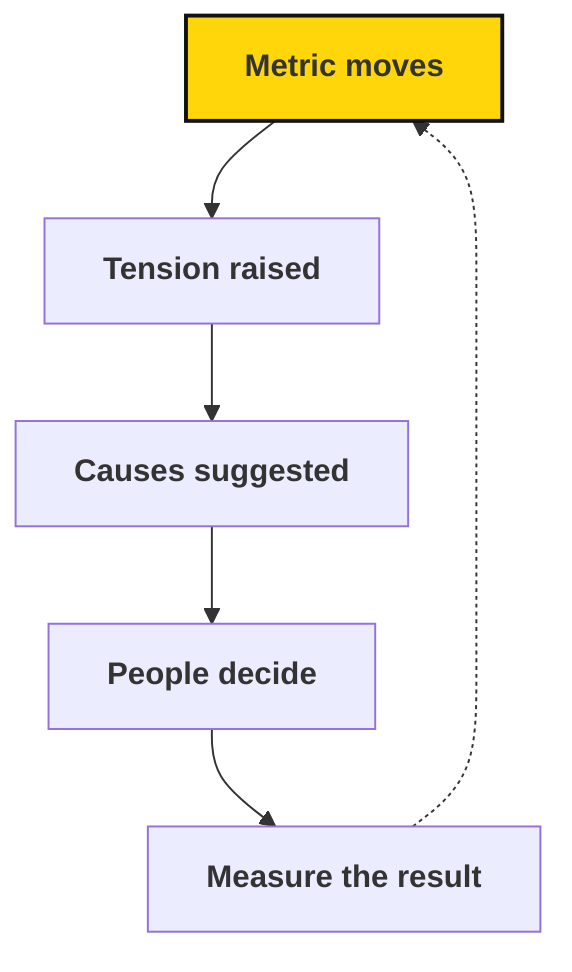

# Atlas and AI: the proposed shared data system

> Where we're heading: Atlas giving everyone a shared, current picture, and AI helping us notice what needs attention.

## In brief

- This whole page describes a direction, not a current feature or requirement. Atlas today records mission, work structure, roles, circles, and assignments — nothing described further down this page yet exists.
- The goal is metrics computed from records the work already produces, not extra reporting, so nobody has to count by hand.
- The proposed loop is: a metric moves, Atlas raises it as a **tension** with the responsible role, likely causes are suggested, people decide, and the result gets measured.
- People keep the consequential decisions — about roles, commitments, and anyone's contribution. AI would only help notice and summarize.

## When to use this

Read this page when:

- You want to understand the direction Atlas and AI are heading, not what they do today.
- You're curious how a metric could become a decision without more meetings.

::: source
Atlas records what currently exists: mission, work structure, roles, circles, and assignments. This page describes a proposed future, not Atlas's current features.
:::

As we grow, keeping everyone informed gets harder. More chapters and projects usually mean more meetings, more reports, and more people whose main job is passing information along. We want to grow without that overhead growing at the same rate.

Our aim is for [Atlas](https://sapiensfirst.org/atlas) to give everyone a shared, current picture of the movement, and for AI to help us make sense of it. That means answering basic questions about the work, turning everyday records into metrics, and noticing what needs attention before someone has to ask. People should be able to act with context instead of waiting for it to reach them through layers of coordination.

::: info Where we are now
Atlas currently records our mission, work structure, roles, circles, and assignments. The rest of this page describes where we're heading. None of it is a current feature or requirement.
:::

## The questions Atlas should answer

- What are we trying to achieve?
- Who is responsible for it?
- What's happening?
- Is it working?
- What needs attention, and what should happen next?

Answering these needs four connected kinds of records:

| Layer | Records | Answers |
| --- | --- | --- |
| Organization | People, roles, circles, accountabilities | Who is responsible |
| Strategy | Objectives, key results, metrics | What we're trying to achieve, and whether it's working |
| Work | Programs, projects, tasks, events | What's happening |
| Learning | Tensions, suggestions, decisions | What needs attention and what to do next |

When these are linked, responsibility is clear without anyone having to piece it together from documents. A key result links to a metric, the metric to the circle responsible for it, and the circle to the projects working on it.

## Get metrics from the work itself

We want metrics to come from the ordinary records of doing the work, not from extra reporting. When someone signs up, attends an orientation, or joins a chapter, that step is already recorded somewhere. So is a project finishing or a role being filled. Atlas can calculate recruitment, retention, and project results from those records, so nobody has to count by hand.

These are records of organizational steps that people already expect us to keep. They aren't a way of tracking anyone's personal activity.

This also lets Atlas keep each metric's history. With a history, we can see trends instead of isolated numbers.

## From a signal to a decision

Once Atlas knows what we're aiming for, who's responsible, and how the numbers are moving, AI can help us notice what needs attention sooner. Here's how that loop should work:

1. A metric moves outside its expected range.
2. Atlas raises it with the responsible role or circle as a **tension**: a gap between how things are and how they could be.
3. It suggests likely causes and possible next steps, with the evidence behind them.
4. The responsible people decide what to do.
5. We measure whether it helped, and learn from the result.

::: example
**Growth objective at risk.** Sign-ups rose 50% over four weeks, but orientation attendance fell from 72% to 41%. Many new members waited more than three days for a scheduling link. Likely bottleneck: orientation capacity. Relevant role: onboarding lead. Possible next steps: make scheduling easier and add a second weekly session.
:::

That's more useful than a red number on a dashboard. It points to a cause, a responsible role, and a next step, and it leaves the decision with people.

Recording tensions, decisions, and their results also builds a memory of what works. Over time, we can learn which approaches actually help.

## Helping organizers do more

The purpose of AI here is to give organizers more time for the work only people can do: conversations, relationships, and leadership. It can help by:

- Taking on routine follow-up people have agreed to hand over, like reminding a new sign-up to choose an orientation time.
- Preparing a summary of the metrics and open tensions before a circle's review.
- Drafting updates, plans, and handoff notes from existing records.
- Suggesting where a role or circle could use more support.

We'll start with suggestions that people approve. Routine, low-risk tasks can move to automatic handling once we trust them. Decisions about people, priorities, and resources stay with people.

## Know the limits

- AI helps us notice and understand. People make consequential decisions, especially about roles, commitments, and anyone's contribution.
- Atlas shouldn't produce performance scores for individuals. A declining number prompts a check-in, as described in [Metrics and people](reviewing-metrics.md#metrics-and-people).
- We only record what we need for the work, and we aim to be clear about what's recorded and why.
- Private organizational information stays out of tools that aren't authorized for it.

::: background Why this matters for how we organize

In *From Hierarchy to Intelligence*, Jack Dorsey and Roelof Botha argue that much of traditional management exists to move information. It collects context from below, relays decisions from above, and keeps teams aligned. They suggest AI can increasingly do that routing, leaving people to own outcomes and develop one another.

This fits the idea behind our [roles and circles](../organization/roles-and-circles.md): distributed responsibility, explicit roles, and people acting with context rather than depending on a single leader. We're drawing on the idea, not adopting any particular company's structure.
:::

::: related
- [Metrics](metrics.md) — Why we measure, and how to define a useful metric.
- [Metric reviews](reviewing-metrics.md) — How circles review results, find bottlenecks, and allocate resources.
- [Decisions](../organization/decisions.md) — What you can decide, when to consult, and what needs approval.
:::
