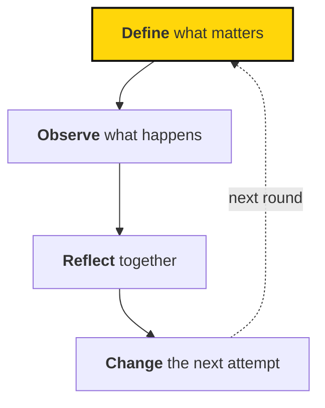

# How we learn and improve

We want to get better at the work, and help others do the same. That means paying attention to results, welcoming feedback, and sharing what we learn.

## A simple rhythm

Learning is a loop. Keep it simple enough that people actually use it.

## Find your guide

**Measure what matters.** Choose a few useful numbers and look at them together.

- [Metrics and learning](metrics.md) — Why we measure, how metrics connect to objectives, and what we don't measure.
- [Reviewing metrics](reviewing-metrics.md) — How circles review results, find bottlenecks, and decide where to put resources.

**See the whole picture.** Build a shared view of the movement that shows what needs attention.

- [Atlas, metrics, and AI](atlas-and-ai.md) — Where we're heading: Atlas and AI that help us notice what needs attention.

**Grow as people.** Give useful feedback and develop through responsibility.

- [Feedback and development](feedback.md) — Builds on our leadership expectations and proposes a way to review growth.

Want the theory behind it? [Learning resources](../strategy/resources.md) in *How we make change* covers movements and our approach.

::: clarify
Atlas doesn't yet store metric definitions or results, and evaluation rubrics are still being developed. Treat proposals on these pages as proposals: they need to be discussed and adopted before they become requirements.
:::
