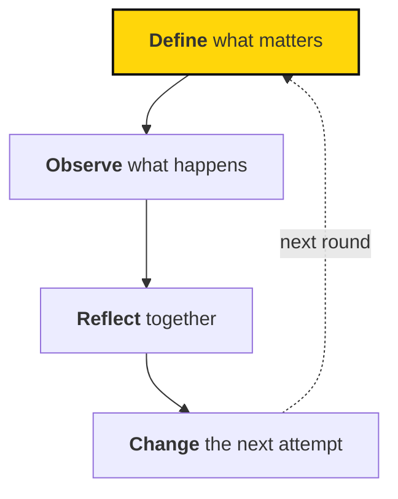

# How Sapiens First measures and learns

> How we measure our work, review the results together, and turn what we learn into a better next attempt.

## In brief

- Learning runs as a loop: define what matters, observe what happens, reflect together, and change the next attempt.
- Metrics and reviewing metrics together describe adopted practice; strategic hypotheses, Atlas and AI, and parts of feedback and development are proposals or a stated direction, not settled requirements.
- Atlas doesn't yet store metric definitions or results, and evaluation rubrics are still being developed.
- The handbook explains the approach to measuring and learning; Atlas holds the current numbers.

## When to use this

Read this page when:

- You want to understand how metrics, reviews, and feedback fit together.
- You're looking for the right page among metrics, strategic hypotheses, metric reviews, Atlas and AI, or feedback and development.

We want to get better at the work, and help others do the same. That means paying attention to results, welcoming feedback, and sharing what we learn.

## A simple rhythm

Learning is a loop. Keep it simple enough that people actually use it.

## Find your guide

**Measure what matters.** Choose a few useful numbers and look at them together.

- [Metrics](metrics.md) — Why we measure, how metrics connect to objectives, and what we don't measure.
- [Strategic hypotheses](strategic-hypotheses.md) — Working backwards from an outcome, and testing strategy as a hypothesis.
- [Metric reviews](reviewing-metrics.md) — How circles review results, find bottlenecks, and decide where to put resources.

**See the whole picture.** Build a shared view of the movement that shows what needs attention.

- [Atlas and AI](atlas-and-ai.md) — Where we're heading: Atlas and AI that help us notice what needs attention.

**Grow as people.** Give useful feedback and develop through responsibility.

- [Feedback and development](feedback.md) — Builds on our leadership expectations and proposes a way to review growth.

Want the theory behind it? [Reading list](../strategy/resources.md) in *The mission* covers movements and our approach.

::: clarify
Atlas doesn't yet store metric definitions or results, and evaluation rubrics are still being developed. Treat proposals on these pages as proposals: they need to be discussed and adopted before they become requirements.
:::

::: related
- [Metrics](metrics.md) — Why we measure, and how to define a useful metric.
- [Metric reviews](reviewing-metrics.md) — How circles review results, find bottlenecks, and allocate resources.
- [Feedback and development](feedback.md) — Builds on our leadership expectations and proposes a way to review growth.
:::
