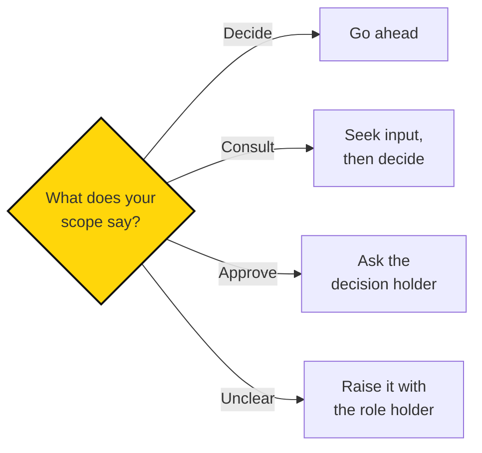

# How Sapiens First makes decisions

> Before starting work, agree on what you can decide, what needs consultation, and what needs approval.

## In brief

- Every scope should mark choices as **Decide** (you choose alone), **Consult** (seek input, then decide), or **Approve** (someone else decides).
- Authority over a project is set in its scope: the scope names the owner and splits decisions into Decide, Consult, and Approve. Atlas records the current owner.
- Fellows currently review project scope and plans with Rohan, including spending, public communications, external commitments, major scope or deadline changes, and important blockers.
- Consultation and approval are different: be clear which one you're asking for and who makes the final call.
- The actual decision holder for a role or project should be recorded in Atlas, not just implied by the handbook's wording.
- A repeatable governance process for changing roles and circle responsibilities is a **proposal**, not yet adopted.

## When to use this

Read this page when:

- You're not sure whether you can decide something yourself, need to consult, or need approval.
- You're a Fellow and want to know what Rohan currently expects to review.
- Responsibility for a decision is unclear and you need to find the right person.

People need room to act and clarity about when to involve others. Here's how to check your decision rights, follow current Fellowship practice, and get help when responsibility isn't clear.

## Check the decision rights

Your role and project scope are the starting points. Here's how to work through a decision:

A useful scope records:

- **Decide:** choices the owner can make independently.
- **Consult:** choices where the owner should seek input from affected people.
- **Approve:** choices reserved for someone else.

Consultation and approval are different. Be clear about which you're asking for and who will make the final decision.

Authority over a project is set in its scope, which names the owner and records these three kinds of decision. Atlas records the current owner and decision holders.

::: source
Atlas records the current decision holder for each role and project. This page explains how to check and use decision rights.
:::

## Follow current Fellowship practice

Fellows review project scope and plans with Rohan. The existing planning guidance also calls for discussing these with him where approval or a decision is needed: spending, public communications, external commitments, major scope or deadline changes, and important blockers.

As we distribute responsibility, record the actual decision holder in the role or project records. A change in the handbook's wording alone doesn't transfer authority.

## When responsibility is unclear

Describe the problem, the work it affects, and the decision you need. Raise it with the relevant role holder or circle contact. Keep a short record of the agreed resolution where others doing the work can find it.

If you can't identify the right person, ask your onboarding or Fellowship contact to help find them.

::: proposal Changing roles and circle responsibilities

A repeatable governance process could let people bring a concrete tension, propose a change to a role or circle, consider effects on others, and record the agreed change in Atlas.

Before adopting this process, we need to settle who can approve changes, how disagreements are resolved, how decisions take effect, and who updates the record. Until then, follow the current decision rights and agreements.
:::

::: related
- [Project scope template](../work/templates.md#project-scope) — A project's objective, scope, success criteria, and decision rights.
- [Roles and circles](roles-and-circles.md) — What roles and circles are, and how to read them in Atlas.
- [Glossary](../guide/glossary.md) — Short definitions of the terms used across the Sapiens First handbook, with links to where each is explained.
:::
