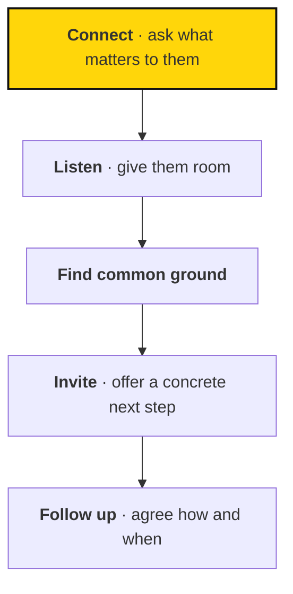

# Having organizing conversations

> One-on-one conversations are a core way to invite people into the movement, and they start with listening.

## In brief

- People are more likely to participate when they feel heard and can see a meaningful place for themselves.
- A good conversation moves through five steps: connect, listen, find common ground, invite, and follow up.
- Listen roughly 80% of the time — a reminder to listen, not a quota to track live.
- Door-knocking is one way to meet people outside your existing network; always respect a person's decision to end the conversation.
- Recruitment is only the beginning — make sure someone can welcome the people who respond.

## When to use this

Read this page when:

- You're preparing to have a one-on-one organizing conversation.
- You want a simple structure to follow, from first contact to a next step.
- You're planning or debriefing a door-knocking session.

One-on-one conversations are a core way to invite people into the movement. Start by listening. People are more likely to participate when they feel heard and can see a meaningful place for themselves.

## A simple conversation

A good conversation moves through five steps, from first contact to a clear next step.

1. **Connect.** Introduce yourself and ask an open question about what matters to the other person.
2. **Listen.** Give them room to explain their concerns and experience. Resist the urge to turn the conversation into a speech.
3. **Find common ground.** Connect their concerns to a relevant part of the movement's work, without pretending you agree about everything.
4. **Invite.** Offer a concrete next step, such as a gathering or introductory meeting.
5. **Follow up.** If they want further contact, agree on how and when.

The original door-knocking guidance suggests listening most of the time—roughly 80%. Use that as a reminder to listen, rather than a quota to track during the conversation.

## Try door-knocking

Door-knocking is one way to meet people outside your existing network. It creates opportunities to hear concerns directly and invite people into local activity.

Prepare a clear introduction and a real event or next step to invite people to. Respect a person's decision to end the conversation. Follow the organizing arrangements and guidance for the place you're working in.

::: roles Learn from each session

Discuss what people cared about, where the invitation was unclear, and whether the next step felt useful. Record what helps the team improve without exposing private personal details.

Recruitment is only the beginning. Make sure someone can welcome the people who respond.
:::

::: related
- [Gatherings](gatherings.md) — Help people connect and take a next step.
- [Local circles](starting-a-circle.md) — Bring a small local group together and share the work.
:::
