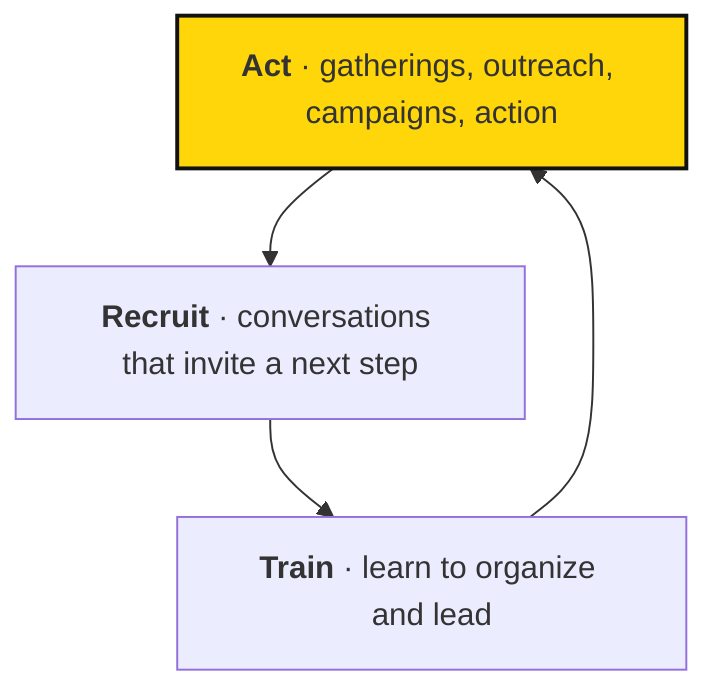

# Sapiens First's mission and strategy

> We imagine a world where AI serves the common good, and we organize to make that possible before powerful AI arrives.

## In brief

- We're organizing against the **AI Crisis**: concentrated economic gains, weakened democracy, and unmanaged security risks from powerful AI.
- Our policy focus is **democratic renewal, common prosperity, and a secure future**.
- Our approach is a cycle: **act, recruit, train** — each turn brings in more people who can lead.
- Three kinds of work build on each other: **community, empowerment, and advocacy**.
- Our [theory of change](#our-theory-of-change): acting together builds community and recruits people; training turns them into organizers; that growing base is what empowerment and advocacy turn into policy change.
- Current campaigns, priorities, and structure live in [Atlas](https://sapiensfirst.org/atlas); this page explains the concepts behind them.

## When to use this

Read this page when:

- You're new to Sapiens First and want to understand why we exist and what we're doing about it.
- You want to see how our activities (gatherings, recruiting, training) fit together.
- You want context before reading the [reading list](resources.md) or current campaign pages.

We believe in technology that uplifts all people, not just a rich few.

## The moment

Powerful AI may arrive soon. Sapiens First is organizing to shape its development before its effects become hard to reverse. Three concerns guide our work:

- **Economic impacts.** The benefits could concentrate among people who already hold wealth and power.
- **Democracy.** AI could strengthen surveillance, autocracy, and other forms of concentrated power.
- **Security.** Powerful AI could cause serious harm through misuse or loss of control.

We call this the AI Crisis. Our answer is to build the public participation and political power to shape what happens next.

## What we stand for

Our policy focus answers each concern:

- **Democratic renewal.** Strengthen democracy to meet the challenges of AI.
- **Common prosperity.** Share the gains from AI broadly.
- **A secure future.** Govern AI so it doesn't cause catastrophic harm.

Find current recommendations on the [policy page](https://sapiensfirst.org/policy), and current work in [Atlas](https://sapiensfirst.org/atlas).

## Act, recruit, train

Our approach is a cycle. Each activity feeds the next, so every turn brings in more people who can lead.

1. **Act.** Bring people together and inspire participation through gatherings, outreach, campaigns, and peaceful action.
2. **Recruit.** Have conversations that invite others to join and take a next step.
3. **Train.** Help people learn to organize, lead, and support others.

Here's how it looks for one person. They come to an event and meet people. They take on a small responsibility. Soon they're helping the next person get involved.

## How the work fits together

Three kinds of work build on each other:

- **Community** builds participation and lasting relationships.
- **Empowerment** gives people the knowledge and confidence to lead.
- **Advocacy** turns that capacity toward political change.

Shared direction, governance, resources, and support hold it all together. Atlas records the current structure, including the DNA pillar and the programs and work linked beneath the mission. This handbook explains the concepts; Atlas holds the current arrangement.

## Our theory of change

We believe the AI Crisis is still open to being shaped, so we build the public participation and political power to change its course. Community work brings people into gatherings and lasting relationships; recruiting invites them to take a next step, and training builds their capacity to organize and lead. That growing base of organizers and relationships is what empowerment and advocacy turn toward political change — pushing for democratic renewal, common prosperity, and a secure future. Each turn of act, recruit, train brings in more people who can lead the next turn, compounding our capacity before powerful AI's effects become hard to reverse.

::: source
Atlas records the current mission structure, campaign priorities, and who owns them. This page explains the strategy and cycle behind that structure.
:::

::: background Assumptions, evidence, and strategy

The source movement guide names mobilizing 3.5% of the population as an ambition. Treat a participation target as a strategic ambition, not a guarantee that reaching a percentage will produce political change.

Our growth depends on more than recruitment. Retention, leadership capacity, relationships, resources, and political conditions matter too. We need to test our assumptions and learn from actual results.

The Fellowship's initial strategy used a California campaign against mass surveillance, “Stop 1984!”, as a concrete starting point. The broader lesson is to choose work that matters, offers a plausible path to progress, and builds capacity for what comes next. Current campaign priorities belong in Atlas and the [campaign pages](https://sapiensfirst.org/campaigns).
:::

::: related
- [How Sapiens First manages work](../work/index.md) — How the mission turns into objectives, projects, and next steps.
- [Metrics](../learning/metrics.md) — Why we measure, and how to define a useful metric.
- [Reading list](resources.md) — Reading on our position, on movements, and on measurement.
- [Values](../organization/values.md) — Core values, operating principles, leadership standards, and red lines.
:::
