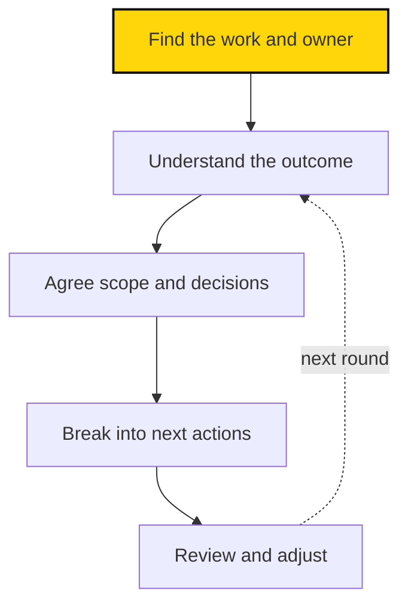

# How Sapiens First manages work

> How the mission turns into objectives, projects, and next steps you can act on.

## In brief

- Every piece of work traces back to the mission through pillars, programs, products or services, and projects.
- An **objective** describes a change; an **output** is a thing you create; a **key result** is the proof that the change happened. [Metrics](../learning/metrics.md) calls that change an **outcome**, and adds **input** for an early, fast-moving measure of effort.
- Work moves in a loop: find it, understand it, agree on it, break it down, and review it.
- Connecting objectives, products, milestones, and tasks into one fixed hierarchy is still a proposal, not settled practice.
- [Atlas](https://sapiensfirst.org/atlas) records current work and who's responsible; these pages explain how to turn that into a plan.

## When to use this

Read this page when:

- You're starting a new piece of work and want to know where it fits.
- You need to tell an objective, an output, and a key result apart.
- You want the shared loop for finding, scoping, and reviewing work.

::: source
Atlas lists current mission, pillar, program, and project records and who owns them. This page explains the concepts behind those records.
:::

Good work starts with a clear purpose. Before you take on a task, know three things: **who it helps, what should change, and how it moves the mission forward.**

## From mission to work

Every piece of work traces back to the mission. Atlas uses these kinds of work records:

| Kind | Plain-language meaning | Example |
| --- | --- | --- |
| Mission | The overall change we are working toward | Political change around AI governance |
| Pillar | A major contribution to that mission | Empowerment |
| Program | Related work organized around a continuing purpose | Knowledge |
| Product or service | Something people can use or benefit from | A resource center or training offering |
| Project | A bounded effort to create or change something | Develop a workshop |

The examples illustrate the concepts. Look in Atlas for current records and their relationships.

A product or service can need several projects over its life. Finishing a project doesn't necessarily end the responsibility to maintain what it produced.

## Outcomes and outputs

Three terms keep plans honest:

- **An [objective](../guide/glossary.md#objective) is a change.** It describes what we want to be different.
- **An output is a thing.** It's something we create.
- **A [key result](../guide/glossary.md#key-result) is the proof.** It tells us how we'll recognize success.

A workshop is an output. Participants who can run their first meeting are the outcome. Both matter: we need to deliver the workshop, and find out whether it helps.

Each key result should point to a defined metric, so everyone reads it the same way. Track the outcome, and also the inputs a role can directly influence. [Metrics](../learning/metrics.md) explains how.

These match the terms in [Metrics](../learning/metrics.md#inputs-and-outcomes): an objective names the outcome we want, a key result is the measure that shows that outcome happened, and an output is what we produce along the way. Metrics adds inputs: the early measures of effort.

::: proposal Connecting objectives, products, and tasks

The working notes propose connecting high-level priorities to products, milestones, tasks, and subtasks. Atlas already has a mission, pillar, program, product/service, and project structure. We should clarify the relationship between these before treating them as a single fixed hierarchy.

A useful starting proposal is:

- Objectives describe the outcomes a piece of work should advance.
- Products and services provide continuing value to defined users.
- Projects create or improve those products, services, or other results.
- Milestones mark meaningful progress or a decision point within a project.
- Tasks describe specific next actions; subtasks help when a task needs breaking down.
- Roles and circles hold responsibility for work and review the results.

Objectives may apply at more than one level. Whether they become separate Atlas records, fields, or linked records remains to be decided. Likewise, this proposal does not mean Atlas already supports task assignment or metric tracking.
:::

## Choose a useful next step

Work moves in a loop. Plan, act, review, and adjust the next round.

1. **Find it.** Locate the relevant work and its owner in Atlas.
2. **Understand it.** Learn the intended outcome and current priority.
3. **Agree on it.** Settle scope, success criteria, and decision rights.
4. **Break it down.** Split the work into milestones and concrete next actions.
5. **Review it.** Look at what happened and adjust the plan.

::: related
- [Projects](projects.md) — Scope, plan, test, and hand off a project.
- [Weekly planning](weekly-work.md) — A simple weekly review and tasks you can act on.
- [Meetings and updates](meetings-and-updates.md) — Check-ins, written updates, and general meetings.
- [Templates](templates.md) — Copyable templates for scopes, plans, updates, and handoffs.
- [Metrics](../learning/metrics.md) — Why we measure, and how to define a useful metric.
:::
