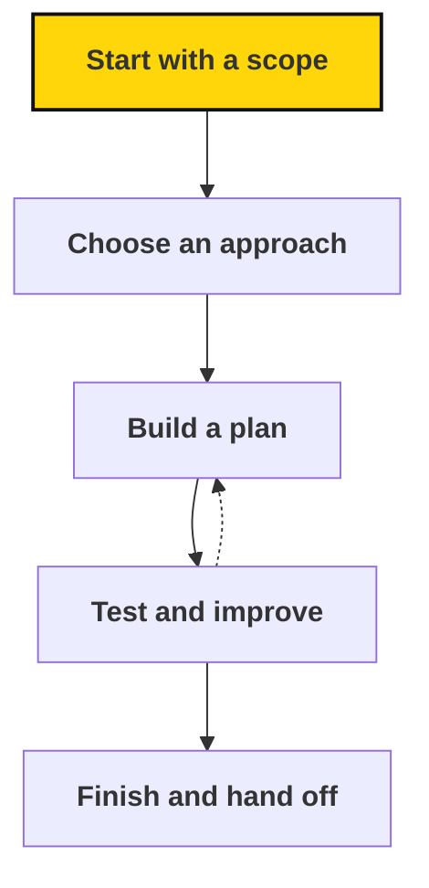

# How projects work at Sapiens First

> A clear scope and a realistic plan keep a project's time on the work that matters, from scope to a finished hand-off.

## In brief

- A [project](../guide/glossary.md#project) is a bounded effort to create or change something; it has a scope, a plan, and a defined hand-off.
- Fellows currently review a project's scope with Rohan before investing heavily in an approach.
- Planning stages — discovery, strategy, a first useful version, testing, iteration, handoff — can overlap and adapt to the project.
- A project is ready to hand off once the agreed output has been checked against its success criteria and the next person can use it.

## When to use this

Read this page when:

- You're scoping a new project and need to know what to write down.
- You're building a plan and want to work backward from the output and deadline.
- You're finishing a project and need to know what a good hand-off includes.

::: source
Atlas lists current projects and their owners. This page explains how projects work.
:::

Here's the shape that work takes, with room to loop back and improve before you finish.

## Start with a scope

Write down the intended outcome, audience, outputs, success criteria, boundaries, constraints, and decision rights. Be explicit about what you're leaving out.

Discuss the scope with the relevant decision holder before investing heavily in a particular approach. Fellows currently review this with Rohan.

Use the [project scope template](templates.md#project-scope). It is a starting point for agreement, not a form to fill out without discussion.

## Choose an approach

Consider the important uncertainties and realistic alternatives. What do you need to learn? What could you try quickly? What depends on another person or team?

A useful strategy helps you make tradeoffs. For example: “Make it easy for a first-time organizer to use, even if that means covering fewer situations.” This is an example, not a movement-wide rule.

## Build a plan

Work backward from the output, success criteria, and deadline. Identify meaningful milestones, then list the actions needed to reach each one.

A milestone says what will be achieved: “Test the workshop with three new organizers” is clearer than “Testing phase.” A task starts with a concrete action: interview, compare, draft, schedule, review, or publish.

Plan around your real capacity and dependencies. Leave time for feedback, revision, and handoff. Don't add reports or presentations unless they help the project or are an agreed requirement.

::: roles Adapt the process to the project

The Fellowship uses discovery, strategy, a first useful version, testing, iteration, and handoff as planning stages. They may overlap. A research project might test a draft argument with readers; an organizing project might pilot one event; a software project might test a prototype.

Bring changes to major outputs or deadlines to the person who holds that decision. Make the tradeoff visible while there is still time to adjust.
:::

## Test and improve

Get feedback from the people the work is for. Check whether the result meets the agreed success criteria and whether your assumptions held up.

Separate essential changes from optional improvements. If the scope is too large, agree on what to reduce or defer rather than letting the deadline drift silently.

## Finish and hand off

A project is ready to hand off when the agreed output has been reviewed against its success criteria and the next person can use it.

- Share the finished work and any remaining limitations.
- Organize files, decisions, and instructions.
- Record the lessons someone else needs.
- Identify any ongoing maintenance and who will take responsibility for it.
- Agree on next steps and update the relevant work record.

Milestones are checkpoints, not automatically additional documents to submit. Keep documentation proportionate to what others need to continue the work.

::: related
- [Templates](templates.md) — Copyable templates for scopes, plans, updates, and handoffs.
- [Metrics](../learning/metrics.md) — Why we measure, and how to define a useful metric.
:::
